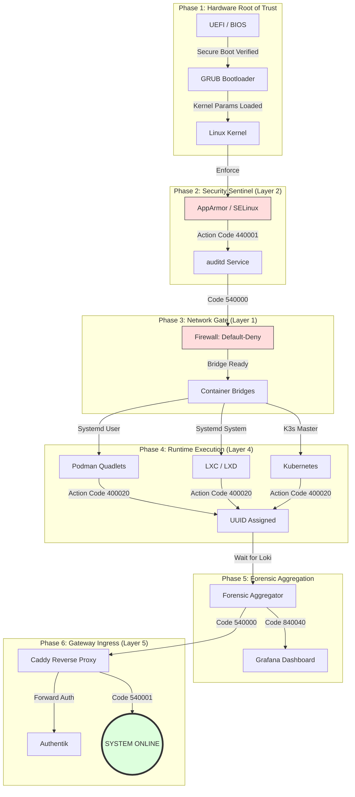

# Explicit Boot Lifecycle & Forensic Chain of Trust

**Standard**: DSU-6767-B  
**Compliance**: NIST SP 800-193 (Platform Integrity) / ISO 27001 §12.4  
**Scope**: All Hardware & Virtualization Runtimes

---

## 🛰️ The Forensic Boot Sequence

This document defines the mandatory execution order during system startup. No layer may initialize until its forensic predecessor has verified the environment.

---

## 🛡️ Forensic Dependency Rules

1.  **Rule [B-01] (The MAC Mandate)**: The Linux Kernel MUST load AppArmor/SELinux profiles before any user-space services are spawned.
2.  **Rule [B-02] (The Aggregator Wait)**: Runtimes (LXC/Podman) MUST perform a TCP handshake check with the Forensic Aggregator (Loki) before emitting their first `Container Start` event.
3.  **Rule [B-03] (The Ingress Lock)**: Caddy MUST NOT open Port 443 until the Authentik identity service reports a healthy state via its local API.

---

*Verified by: DSU Platform Architect*  
*Last Updated: February 2026*
