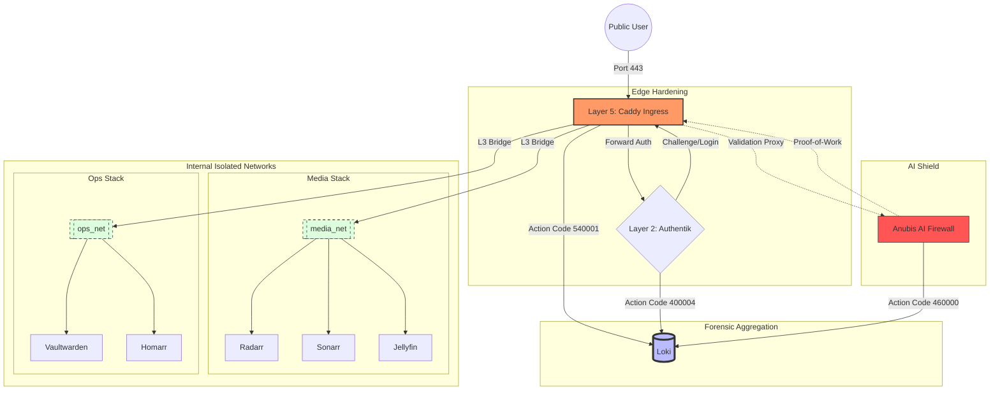

# Network Topology: Data Flow & Isolation

This diagram visualizes the traffic flow from the public internet through the **Deploy-System-Unified** security layers to the backend services.

---

## 🔒 Security Posture Analysis

1.  **Strict Ingress**: Only Caddy (Port 443) is exposed to the host/internet.
2.  **Internal Isolation**: Backends (Radarr, Sonarr, etc.) have NO direct host ports. They communicate only via internal bridge networks.
3.  **Forward-Auth**: No request reaches a backend unless Authentik verifies the session headers.
4.  **Forensic Trail**: Every transition between networks is logged via Action Codes to Loki.

*Generated by DSU Architecture Creator*  
*Standard: NIST SC-7 (Boundary Protection)*
