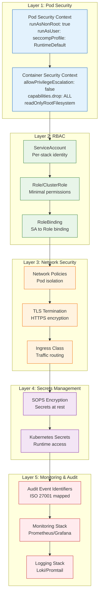

# Security Architecture: Defense-in-Depth

**Audit Event Identifier:** DSU-MMD-180001  
**Mermaid Version:** 1.2  
**Renderer Support:** GitHub, GitLab, Mermaid Live  
**Last Updated:** 2026-02-28  

This document visualizes the 5-layer security model enforced by **Deploy-System-Unified**. Each layer must be successfully provisioned and verified before the next layer is applied.

---

## 🛡️ The 5-Layer Model

| Layer | Name | Roles Involved | Audit Event Identifier Range | Purpose |
|-------|------|----------------|-----------------------------|---------|
| **1** | Pod Security | `containers/runtime`, `containers/quadlets` | `70xxxx` | Container isolation via security contexts |
| **2** | RBAC | `kubernetes/rbac`, `core/identity` | `30xxxx` | Least-privilege access control |
| **3** | Network Security | `networking/firewall`, `containers/caddy` | `54xxxx` | Traffic isolation and encryption |
| **4** | Secrets Management | `core/secrets`, `security/tpm_guard` | `45xxxx` | Encrypted secrets at rest and in transit |
| **5** | Monitoring & Audit | `core/logging`, `security/audit_integrity` | `84xxxx` | Forensic traceability and alerting |

---

## 🔗 Related Documentation

- [Security Architecture Overview](../deployment/mermaid/07_security_architecture.md) - Detailed security diagram
- [Forensic Flow](./FORENSIC_FLOW.md) - How audit events flow to Loki
- [Boot Lifecycle](./BOOT_LIFECYCLE.md) - Security during system startup

---

*Standard: ISO 27001 §8.20 (Network Security)*
*Last Updated: 2026-02-28*
