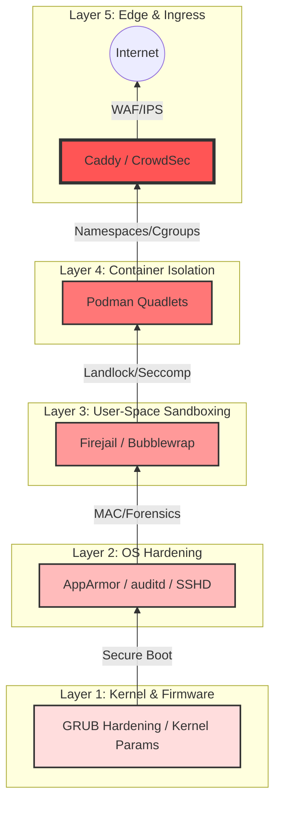

# Security Architecture: Defense-in-Depth

This document visualizes the 5-layer security model enforced by **Deploy-System-Unified**. Each layer must be successfully provisioned and verified before the next layer is applied.

---

## 🛡️ The 5-Layer Model

| Layer | Roles Involved | Audit Event Identifier Range | Purpose |
|-------|----------------|-------------------|---------|
| **1. Kernel** | `security/kernel`, `core/grub` | `45xxxx` | Establish root of trust and memory protection. |
| **2. OS** | `security/hardening`, `security/sshd` | `40xxxx`, `51xxxx` | Attack surface reduction and forensic logging. |
| **3. Sandbox**| `security/sandboxing`, `security/firejail` | `41xxxx`, `42xxxx` | Restrict binary-level capabilities. |
| **4. Container**| `containers/runtime`, `containers/quadlets` | `7xxxxx` | Workload isolation and resource limits. |
| **5. Edge** | `containers/caddy`, `security/ips` | `54xxxx` | Real-time threat detection and reverse proxy. |

---

*Generated by DSU Architecture Creator*  
*Standard: ISO 27001 §8.20 (Network Security)*
