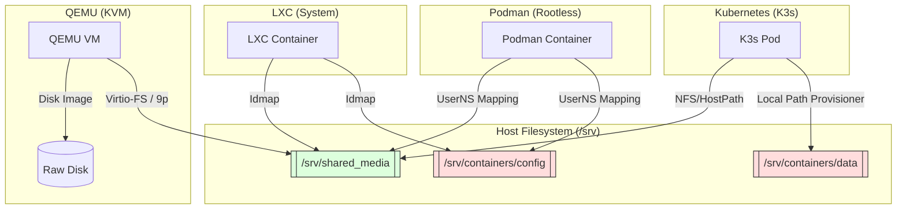

# Storage Interaction & Directory Access Matrix

This document maps how different container and virtualization runtimes interact with the host filesystem and shared data locations in **Deploy-System-Unified**.

---

## 📂 Directory Ownership Standard

All persistent data is consolidated under `/srv` to ensure a consistent security boundary.

| Path | Purpose | Owner (Host) | Access Mode |
| :--- | :--- | :--- | :--- |
| `/srv/containers/config` | App Configurations | `root` or `admin` | Read/Write (Z-labeled) |
| `/srv/containers/data` | Application Data | `media (1000)` | Read/Write (Z-labeled) |
| `/srv/containers/secrets` | SOPS/Age Secrets | `root` | Read-Only (0600) |
| `/srv/shared_media` | Bulk Media Storage | `media (1000)` | Read/Write (Shared) |

---

## 📊 Runtime Storage Interaction

---

## 🛡️ Forensic Isolation Rules (Storage)

### 1. SELinux/AppArmor Labeling
- **Rule**: All volumes mounted to Podman/LXC MUST use the `:Z` suffix (e.g., `/data:/data:Z`).
- **Forensic Code**: `ISO 27001 §8.20 | Action 700000`

### 2. UID/GID Mapping (UserNS)
- **Standard**: The project standardizes on **UID 1000** for the `media` user across all runtimes.
- **LXC Implementation**: Uses `lxc.idmap` to map host 1000 to container 1000.
- **Podman Implementation**: Uses rootless subuid mapping (Code `420001`).

### 3. Cross-Runtime Data Locking
- **Risk**: Simultaneous write access to the same SQLite DB from LXC and Podman.
- **Mitigation**: Only ONE runtime should have Write access to a specific application config directory at any time.

---

*Verified by: DSU Storage Architect*  
*Compliance: ISO 27040 / NIST SP 800-193*
