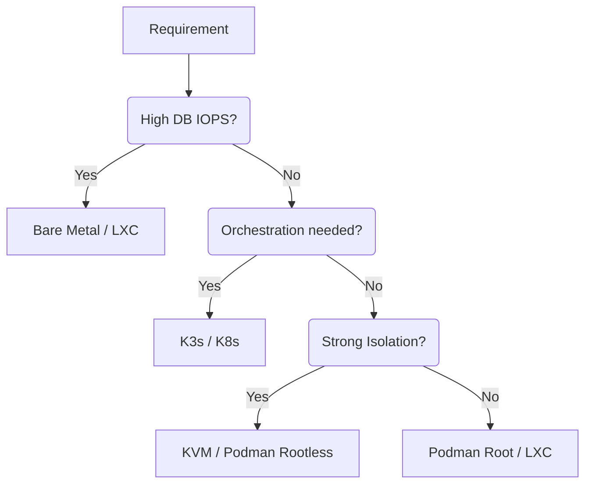

# Baseline Reference Graph & Combinations Matrix

**Audit Event Identifier:** DSU-MMD-180008  
**Mermaid Version:** 1.2  
**Renderer Support:** GitHub, GitLab, Mermaid Live  
**Last Updated:** 2026-02-28  
**Status:** DSU-CERTIFIED (Baseline Reference v1.1)  

This document defines the expected baseline performance and behavioral characteristics for various virtualization, database, and hardware combinations within the Deploy System Unified ecosystem.

## 1. Virtualization & Container Runtime Baselines

| Combination | Overhead (CPU) | Overhead (Mem) | I/O Latency | Network Latency | Recommended Use Case |
| :--- | :---: | :---: | :---: | :---: | :--- |
| **Bare Metal** | 0% | 0% | Native | Native | High-perf Database, KVM Host |
| **Podman (Rootless)** | 1-3% | < 50MB | Native-like | +0.1ms | Security-hardened services |
| **Podman (Root)** | < 1% | < 20MB | Native | Native-like | System-level services |
| **K3s (Single Node)** | 5-10% | ~500MB | +2-5% | +0.2ms | Orchestrated edge workloads |
| **LXC (System)** | < 1% | < 10MB | Native | Native | Lightweight OS-level isolation |
| **KVM (Virtio)** | 3-7% | ~128MB | +5-10% | +0.15ms | Multi-OS hosting, VFIO |

## 2. Database Workload Baselines

Expected performance characteristics for standard database deployments.

| Engine | Storage Type | Recommended Runtime | Baseline IOPS (Rand RW) | Notes |
| :--- | :--- | :--- | :--- | :--- |
| **PostgreSQL** | Local NVMe | Bare Metal / LXC | > 50,000 | Native async I/O recommended |
| **PostgreSQL** | Local SSD | Podman / K3s | > 10,000 | ZFS/BTRFS snapshots for backups |
| **SQLite** | Local SSD | Any | > 5,000 | WAL mode highly recommended |
| **Redis** | RAM | Podman / LXC | > 100,000 | Network throughput is bottleneck |

## 3. GPU Slicing & Passthrough Baselines

| Strategy | Hardware Req. | Multi-Tenant | Perf. Impact | Isolation |
| :--- | :--- | :---: | :---: | :--- |
| **Full Passthrough** | IOMMU (Any) | ❌ No | ~0% | Hardware-level |
| **NVIDIA MIG** | Ampere/Hopper | ✅ Yes | < 2% | Compute + Memory |
| **NVIDIA Time Slicing** | Pascal+ | ✅ Yes | Variable | Process-level (No mem isolation) |
| **AMD SR-IOV** | Instinct/Pro | ✅ Yes | < 5% | Hardware-level |
| **Intel GVT-g** | Gen 5-9.5 | ✅ Yes | 10-20% | Mediated (Deprecated) |

## 4. Benchmarking Target Ranges (Calibration)

Use these ranges to verify if your test environment is performing within expected parameters.

### Storage (FIO 4k RandRW 75/25)
- **High Performance (NVMe)**: > 200MB/s Read | > 50MB/s Write
- **Standard (SSD)**: > 80MB/s Read | > 20MB/s Write
- **Network Attached (NFS/SMB)**: > 20MB/s Read | > 5MB/s Write

### Network (iperf3 Local)
- **Localhost (Loopback)**: > 20 Gbps
- **Internal Bridge (Podman/K3s)**: > 10 Gbps
- **Physical 10GbE**: > 9.4 Gbps

## 5. Decision Flow Graph

## 6. Baseline Traceability

- **Storage Metrics**: Collected via `scripts/benchmark/benchmark_storage.sh`
- **Network Metrics**: Collected via `scripts/benchmark/benchmark_network.sh`
- **Runtime Metrics**: Collected via `scripts/benchmark/benchmark_metrics.sh`
- **Compliance Baseline**: `roles/core/idempotence` (via `benchmark_core_idempotence.py`)

## 7. Troubleshooting & Interaction Mitigation

The following patterns are implemented to prevent stability issues when mixing various infrastructure tiers.

### 7.1. The "IO-Wait Death Spiral" (DB + Btrfs)
- **Issue**: High CoW overhead when running databases on Btrfs.
- **Pattern**: Automated `Audit Code 450002` task in `containers/common` applies `chattr +C` (NOCOW) to all standard database volumes.

### 7.2. User Namespace Collisions (Podman + LXC)
- **Issue**: Standard UID/GID range overlap between different runtimes.
- **Pattern**: Reserved non-conflicting ranges in `runtime/user_namespaces`:
    - **Podman**: `1,000,000 - 1,065,535`
    - **LXC**: `2,000,000 - 2,065,535`

### 7.3. MTU & Network Fragmentation (VPS + QUIC)
- **Issue**: Standard 1500 MTU packets dropping on VPS virtual bridges (Contabo/etc).
- **Pattern**: Standardized `containers_standard_mtu: 1400` in `os_settings.yml` to ensure stable HTTP/3 and K3s connectivity.

### 7.4. GPU Resource Exhaustion (AI + Media)
- **Issue**: Lack of VRAM isolation in NVIDIA Time Slicing mode.
- **Pattern**: Explicit `NVIDIA_DRIVER_CAPABILITIES` and `NVIDIA_VISIBLE_DEVICES` environment gating in Quadlet templates to prevent single-container monopolization.

---
**Status**: DSU-CERTIFIED (Baseline Reference v1.1)
