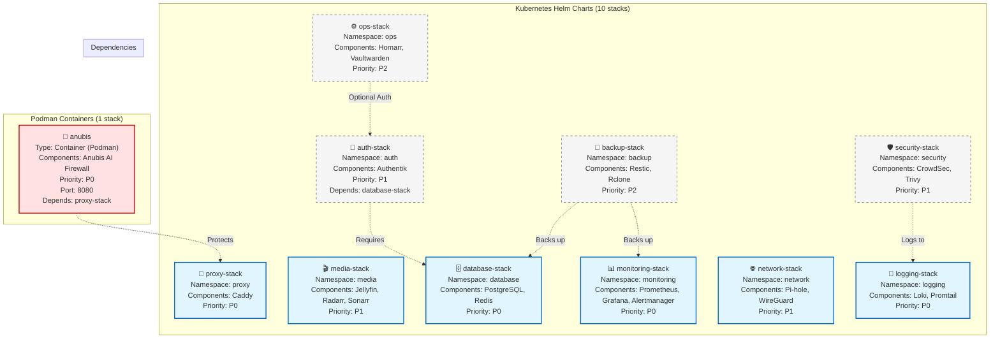

---

## 📋 Stack Details

| Stack | Namespace | Priority | Components |
|-------|-----------|----------|------------|
| monitoring-stack | monitoring | P0 | Prometheus, Grafana, Alertmanager |
| media-stack | media | P1 | Jellyfin, Radarr, Sonarr |
| logging-stack | logging | P0 | Loki, Promtail |
| database-stack | database | P0 | PostgreSQL, Redis |
| auth-stack | auth | P1 | Authentik |
| backup-stack | backup | P2 | Restic, Rclone |
| network-stack | network | P1 | Pi-hole, WireGuard |
| proxy-stack | proxy | P0 | Caddy |
| ops-stack | ops | P2 | Homarr, Vaultwarden |
| security-stack | security | P1 | CrowdSec, Trivy |
| anubis | N/A (Podman) | P0 | Anubis AI Firewall |

---

## 🔗 See Also

- [Deployment Profiles](./02_deployment_profiles.md) - Which stacks are in each profile
- [Stack Dependencies](./03_stack_dependencies.md) - Detailed dependency graph
- [Incompatibilities](./04_incompatibilities.md) - Combinations to avoid
