```mermaid
graph LR
    subgraph "Profile A: MINIMAL"
        A1["📊 monitoring<br/>✅"]
        A2["🎬 media<br/>✅"]
        A3["Resources:<br/>2 CPU<br/>4Gi RAM<br/>10Gi Storage"]
    end

    subgraph "Profile B: STANDARD"
        B1["📊 monitoring<br/>✅"]
        B2["🎬 media<br/>✅"]
        B3["📝 logging<br/>✅"]
        B4["🗄️ database<br/>✅"]
        B5["🔐 auth<br/>✅"]
        B6["🌐 network<br/>✅"]
        B7["🔀 proxy<br/>✅"]
        B8["⚙️ ops<br/>✅"]
        B9["Resources:<br/>4 CPU<br/>8Gi RAM<br/>20Gi Storage"]
    end

    subgraph "Profile C: PRODUCTION"
        C1["📊 monitoring<br/>✅"]
        C2["🎬 media<br/>✅"]
        C3["📝 logging<br/>✅"]
        C4["🗄️ database<br/>✅"]
        C5["🔐 auth<br/>✅"]
        C6["💾 backup<br/>✅"]
        C7["🌐 network<br/>✅"]
        C8["🔀 proxy<br/>✅"]
        C9["⚙️ ops<br/>✅"]
        C10["🛡️ security<br/>✅"]
        C11["🤖 anubis<br/>✅"]
        C12["Resources:<br/>16+ CPU<br/>64Gi+ RAM<br/>800Gi+ Storage"]
    end

    subgraph "Profile D: MONITORING"
        D1["📊 monitoring<br/>✅"]
        D2["📝 logging<br/>✅"]
        D3["💾 backup<br/>✅"]
        D4["🔀 proxy<br/>✅"]
        D5["🛡️ security<br/>✅"]
        D6["Resources:<br/>4 CPU<br/>16Gi RAM<br/>200Gi Storage"]
    end

    subgraph "Profile E: MEDIA"
        E1["📊 monitoring<br/>✅"]
        E2["🎬 media<br/>✅"]
        E3["💾 backup<br/>✅"]
        E4["🌐 network<br/>✅"]
        E5["🔀 proxy<br/>✅"]
        E6["Resources:<br/>8+ CPU<br/>16Gi RAM<br/>1Ti+ Storage"]
    end

    subgraph "Profile F: SECURITY"
        F1["📊 monitoring<br/>✅"]
        F2["📝 logging<br/>✅"]
        F3["🗄️ database<br/>✅"]
        F4["🔐 auth<br/>✅"]
        F5["💾 backup<br/>✅"]
        F6["🌐 network<br/>✅"]
        F7["🔀 proxy<br/>✅"]
        F8["🛡️ security<br/>✅"]
        F9["🤖 anubis<br/>✅"]
        F10["Resources:<br/>8 CPU<br/>32Gi RAM<br/>430Gi Storage"]
    end

    classDef minimal fill:#e8f5e9,stroke:#2e7d32
    classDef standard fill:#e3f2fd,stroke:#1565c0
    classDef production fill:#ffebee,stroke:#c62828
    classDef monitoring fill:#fff3e0,stroke:#ef6c00
    classDef media fill:#f3e5f5,stroke:#7b1fa2
    classDef security fill:#e0f2f1,stroke:#00796b

    class A1,A2,A3 minimal
    class B1,B2,B3,B4,B5,B6,B7,B8,B9 standard
    class C1,C2,C3,C4,C5,C6,C7,C8,C9,C10,C11,C12 production
    class D1,D2,D3,D4,D5,D6 monitoring
    class E1,E2,E3,E4,E5,E6 media
    class F1,F2,F3,F4,F5,F6,F7,F8,F9,F10 security
```

---

## 📋 Profile Summary

| Profile | Stacks | CPU | Memory | Storage | Use Case |
|---------|--------|-----|--------|---------|----------|
| **A: MINIMAL** | 2 | 2 | 4Gi | 10Gi | Testing, lightweight labs |
| **B: STANDARD** | 8 | 4 | 8Gi | 20Gi | General home server |
| **C: PRODUCTION** | 11 | 16+ | 64Gi+ | 800Gi+ | Full production |
| **D: MONITORING** | 5 | 4 | 16Gi | 200Gi | Observability focus |
| **E: MEDIA** | 5 | 8+ | 16Gi | 1Ti+ | Media streaming |
| **F: SECURITY** | 9 | 8 | 32Gi | 430Gi | Security operations |

---

## 🔗 See Also

- [Complete Stack Overview](./01_complete_stack_overview.md) - All available stacks
- [Resource Requirements](./05_resource_requirements.md) - Detailed hardware specs
- [Decision Tree](./06_decision_tree.md) - How to choose a profile
