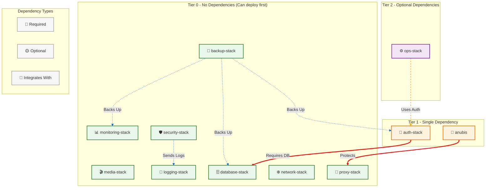

---

## 📋 Dependency Tiers

### Tier 0 - No Dependencies (Deploy First)
- monitoring-stack, media-stack, logging-stack, database-stack
- backup-stack, network-stack, proxy-stack, security-stack

### Tier 1 - Single Dependency
- **auth-stack** → requires database-stack
- **anubis** → protects proxy-stack

### Tier 2 - Optional Dependencies
- **ops-stack** → optionally uses auth-stack

---

## 🔗 See Also

- [Complete Stack Overview](./01_complete_stack_overview.md) - All stacks details
- [Deployment Workflow](./08_deployment_workflow.md) - Deployment order
- [Incompatibilities](./04_incompatibilities.md) - Combinations to avoid
