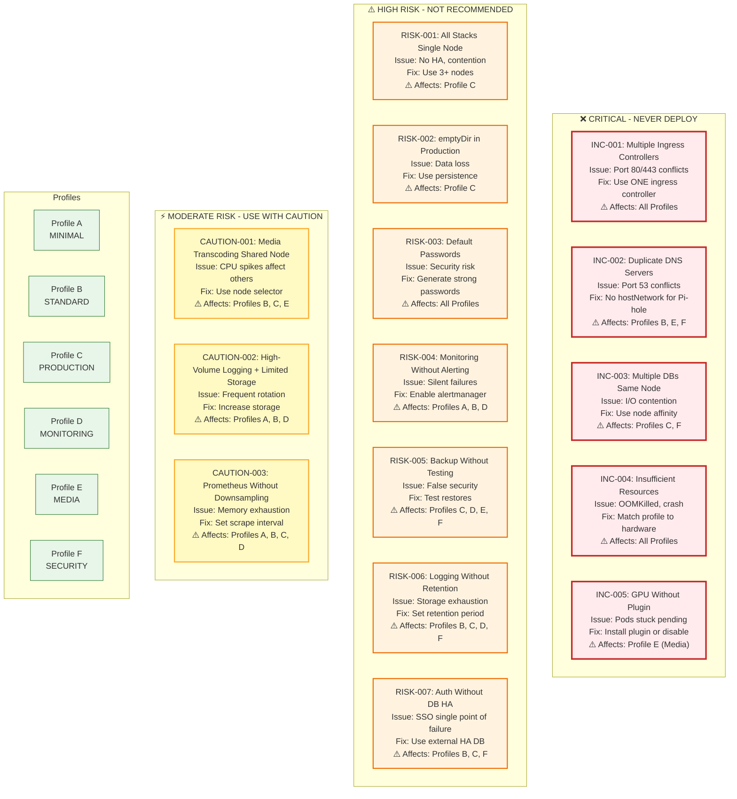

---

## 📋 Affected Profiles Matrix

| Issue | A | B | C | D | E | F |
|-------|:-:|:-:|:-:|:-:|:-:|:-:|
| **INC-001** Multiple Ingress | ✅ | ✅ | ✅ | ✅ | ✅ | ✅ |
| **INC-002** Duplicate DNS | ❌ | ⚠️ | ❌ | ❌ | ⚠️ | ⚠️ |
| **INC-003** Multiple DBs | ❌ | ❌ | ⚠️ | ❌ | ❌ | ⚠️ |
| **INC-004** Insufficient Resources | ✅ | ✅ | ✅ | ✅ | ✅ | ✅ |
| **INC-005** GPU Without Plugin | ❌ | ❌ | ❌ | ❌ | ⚠️ | ❌ |
| **RISK-001** All Stacks Single Node | ❌ | ❌ | ⚠️ | ❌ | ❌ | ❌ |
| **RISK-002** emptyDir Production | ❌ | ❌ | ⚠️ | ❌ | ❌ | ❌ |
| **RISK-003** Default Passwords | ✅ | ✅ | ✅ | ✅ | ✅ | ✅ |
| **RISK-004** Monitoring No Alerting | ⚠️ | ⚠️ | ❌ | ⚠️ | ❌ | ❌ |
| **RISK-005** Backup Without Testing | ❌ | ❌ | ⚠️ | ⚠️ | ⚠️ | ⚠️ |
| **RISK-006** Logging No Retention | ❌ | ⚠️ | ⚠️ | ⚠️ | ❌ | ⚠️ |
| **RISK-007** Auth Without DB HA | ❌ | ⚠️ | ❌ | ❌ | ❌ | ⚠️ |
| **CAUTION-001** Transcoding Shared | ❌ | ⚠️ | ⚠️ | ❌ | ⚠️ | ❌ |
| **CAUTION-002** High-Volume Logging | ⚠️ | ⚠️ | ❌ | ⚠️ | ❌ | ❌ |
| **CAUTION-003** Prometheus No Downsample | ⚠️ | ⚠️ | ⚠️ | ⚠️ | ❌ | ❌ |

**Legend:** ✅ = Critical | ⚠️ = Applies | ❌ = Not applicable

---

## 🔧 Mitigation Checklist

### Before Deployment
- [ ] Verify hardware meets profile requirements (see [Resource Requirements](./05_resource_requirements.md))
- [ ] Generate strong passwords using `openssl rand -base64 32`
- [ ] Review network topology for port conflicts
- [ ] Confirm single ingress controller configuration

### During Deployment
- [ ] Monitor resource usage via `kubectl top nodes`
- [ ] Verify PVC binding and storage class
- [ ] Check pod scheduling and affinity rules

### After Deployment
- [ ] Test backup restoration procedure
- [ ] Configure alertmanager routing
- [ ] Set log retention policies
- [ ] Validate HA database connections

---

## See Also

- [Deployment Profiles](./02_deployment_profiles.md) - Profile stack compositions
- [Decision Tree](./06_decision_tree.md) - Choosing the right profile
- [Security Architecture](./07_security_architecture.md) - Security controls overview
