## 📊 Resource Comparison Table

| Profile | CPU | Memory | Storage | Best For |
|---------|-----|--------|---------|----------|
| **A: MINIMAL** | 2 cores | 4 Gi | 10 Gi | Testing, lightweight home labs |
| **B: STANDARD** | 4 cores | 8 Gi | 20 Gi | General home server use |
| **C: PRODUCTION** | 16+ cores | 64+ Gi | 800+ Gi | Full production deployments |
| **D: MONITORING** | 4 cores | 16 Gi | 200 Gi | Observability-focused deployments |
| **E: MEDIA** | 8+ cores | 16 Gi | 1+ Ti | Media streaming with transcoding |
| **F: SECURITY** | 8 cores | 32 Gi | 430 Gi | Security-focused deployments |

---

```mermaid
graph LR
    subgraph "Profile A: MINIMAL"
        A_CPU["📊 CPU: 2 cores"]
        A_RAM["💾 Memory: 4 Gi"]
        A_DISK["🗄️ Storage: 10 Gi"]
    end

    subgraph "Profile B: STANDARD"
        B_CPU["📊 CPU: 4 cores"]
        B_RAM["💾 Memory: 8 Gi"]
        B_DISK["🗄️ Storage: 20 Gi"]
    end

    subgraph "Profile C: PRODUCTION"
        C_CPU["📊 CPU: 16+ cores"]
        C_RAM["💾 Memory: 64+ Gi"]
        C_DISK["🗄️ Storage: 800+ Gi"]
    end

    subgraph "Profile D: MONITORING"
        D_CPU["📊 CPU: 4 cores"]
        D_RAM["💾 Memory: 16 Gi"]
        D_DISK["🗄️ Storage: 200 Gi"]
    end

    subgraph "Profile E: MEDIA"
        E_CPU["📊 CPU: 8+ cores"]
        E_RAM["💾 Memory: 16 Gi"]
        E_DISK["🗄️ Storage: 1+ Ti"]
    end

    subgraph "Profile F: SECURITY"
        F_CPU["📊 CPU: 8 cores"]
        F_RAM["💾 Memory: 32 Gi"]
        F_DISK["🗄️ Storage: 430 Gi"]
    end

    classDef minimal fill:#e8f5e9,stroke:#2e7d32
    classDef standard fill:#e3f2fd,stroke:#1565c0
    classDef production fill:#ffebee,stroke:#c62828
    classDef monitoring fill:#fff3e0,stroke:#ef6c00
    classDef media fill:#f3e5f5,stroke:#7b1fa2
    classDef security fill:#e0f2f1,stroke:#00796b

    class A_CPU,A_RAM,A_DISK minimal
    class B_CPU,B_RAM,B_DISK standard
    class C_CPU,C_RAM,C_DISK production
    class D_CPU,D_RAM,D_DISK monitoring
    class E_CPU,E_RAM,E_DISK media
    class F_CPU,F_RAM,F_DISK security
```

## See Also

- [Deployment Profiles](./02_deployment_profiles.md) - Stack composition by profile
- [Decision Tree](./06_decision_tree.md) - How to choose the right profile
