```mermaid
graph TB
    START["🚀 Start Deployment"]

    Q1{"Primary use:<br/>Media streaming?"}
    Q2{"Need full<br/>production stack?"}
    Q3{"Focus:<br/>Security monitoring?"}
    Q4{"Focus:<br/>Observability only?"}
    Q5{"Resources:<br/>≥4 CPU, ≥8Gi RAM?"}

    A["Profile A<br/>MINIMAL<br/>2 CPU, 4Gi, 10Gi<br/>Stacks: monitoring, media"]
    B["Profile B<br/>STANDARD<br/>4 CPU, 8Gi, 20Gi<br/>Stacks: 8 general-purpose"]
    C["Profile C<br/>PRODUCTION<br/>16+ CPU, 64Gi+, 800Gi+<br/>Stacks: All 11 stacks"]
    D["Profile D<br/>MONITORING<br/>4 CPU, 16Gi, 200Gi<br/>Stacks: monitoring, logging, backup, proxy, security"]
    E["Profile E<br/>MEDIA<br/>8+ CPU, 16Gi, 1Ti+<br/>Stacks: media, monitoring, backup, network, proxy"]
    F["Profile F<br/>SECURITY<br/>8 CPU, 32Gi, 430Gi<br/>Stacks: security, monitoring, logging, auth, database, backup, network, proxy, anubis"]

    START --> Q1
    Q1 -->|Yes| E
    Q1 -->|No| Q2

    Q2 -->|Yes| C
    Q2 -->|No| Q3

    Q3 -->|Yes| F
    Q3 -->|No| Q4

    Q4 -->|Yes| D
    Q4 -->|No| Q5

    Q5 -->|Yes| B
    Q5 -->|No| A

    classDef start fill:#e3f2fd,stroke:#1565c0,stroke-width:2px
    classDef question fill:#fff3e0,stroke:#ef6c00,stroke-width:2px
    classDef profile fill:#e8f5e9,stroke:#2e7d32,stroke-width:2px

    class START start
    class Q1,Q2,Q3,Q4,Q5 question
    class A,B,C,D,E,F profile
```

## 🌳 Decision Guide

### Question 1: Media Streaming?
- **Yes** → Profile E (MEDIA) is optimized for Jellyfin, Radarr, Sonarr with transcoding support
- **No** → Continue to question 2

### Question 2: Full Production Stack?
- **Yes** → Profile C (PRODUCTION) deploys all 11 stacks with maximum resources
- **No** → Continue to question 3

### Question 3: Security Monitoring Focus?
- **Yes** → Profile F (SECURITY) includes CrowdSec, Trivy, Anubis, and full audit trail
- **No** → Continue to question 4

### Question 4: Observability Only?
- **Yes** → Profile D (MONITORING) focuses on Prometheus, Grafana, Loki, and backups
- **No** → Continue to question 5

### Question 5: Sufficient Resources?
- **Yes** (≥4 CPU, ≥8Gi RAM) → Profile B (STANDARD) for general home server use
- **No** → Profile A (MINIMAL) for testing and lightweight deployments

---

## 📋 Profile Quick Reference

| If You Need... | Choose Profile |
|----------------|----------------|
| Home media server with transcoding | **E: MEDIA** |
| Everything, all features enabled | **C: PRODUCTION** |
| Security operations center (SOC) | **F: SECURITY** |
| Infrastructure monitoring & alerting | **D: MONITORING** |
| General home lab / multi-purpose | **B: STANDARD** |
| Quick test / minimal footprint | **A: MINIMAL** |

---

## See Also

- [Resource Requirements](./05_resource_requirements.md) - Detailed hardware specs
- [Deployment Profiles](./02_deployment_profiles.md) - Stack composition details
- [Incompatibilities](./04_incompatibilities.md) - Combinations to avoid
