```mermaid
graph TB
    subgraph "Layer 1: Pod Security"
        PSC["Pod Security Context<br/>runAsNonRoot: true<br/>runAsUser: <app-specific><br/>seccompProfile: RuntimeDefault"]
        CSC["Container Security Context<br/>allowPrivilegeEscalation: false<br/>capabilities.drop: ALL<br/>readOnlyRootFilesystem"]
    end

    subgraph "Layer 2: RBAC"
        SA["ServiceAccount<br/>Per-stack identity"]
        ROLE["Role/ClusterRole<br/>Minimal permissions"]
        ROLEBIND["RoleBinding<br/>SA to Role binding"]
    end

    subgraph "Layer 3: Network Security"
        NP["Network Policies<br/>Pod isolation"]
        TLS["TLS Termination<br/>HTTPS encryption"]
        ING["Ingress Class<br/>Traffic routing"]
    end

    subgraph "Layer 4: Secrets Management"
        SOPS["SOPS Encryption<br/>Secrets at rest"]
        K8S["Kubernetes Secrets<br/>Runtime access"]
    end

    subgraph "Layer 5: Monitoring & Audit"
        AUDIT["Audit Event Identifiers<br/>ISO 27001 mapped"]
        MON["Monitoring Stack<br/>Prometheus/Grafana"]
        LOG["Logging Stack<br/>Loki/Promtail"]
    end

    subgraph "Layer 6: Host & Data Integrity"
        IMA["IMA Enforcement<br/>Kernel-level integrity"]
        DBE["Row-Level Encryption<br/>Vault Transit rotation"]
    end

    PSC --> CSC
    CSC --> SA
    SA --> ROLE
    ROLE --> ROLEBIND
    ROLEBIND --> NP
    NP --> TLS
    TLS --> ING
    ING --> SOPS
    SOPS --> K8S
    K8S --> AUDIT
    AUDIT --> MON
    MON --> LOG
    LOG --> IMA
    IMA --> DBE

    classDef layer1 fill:#e3f2fd,stroke:#1565c0
    classDef layer2 fill:#e8f5e9,stroke:#2e7d32
    classDef layer3 fill:#fff3e0,stroke:#ef6c00
    classDef layer4 fill:#f3e5f5,stroke:#7b1fa2
    classDef layer5 fill:#ffebee,stroke:#c62828
    classDef layer6 fill:#fafafa,stroke:#333333

    class PSC,CSC layer1
    class SA,ROLE,ROLEBIND layer2
    class NP,TLS,ING layer3
    class SOPS,K8S layer4
    class AUDIT,MON,LOG layer5
    class IMA,DBE layer6
```

---

## 🛡️ Security Layer Details

| Layer | Components | Purpose |
|-------|------------|---------|
| **1: Pod Security** | Security Contexts, Capabilities Drop | Container isolation |
| **2: RBAC** | ServiceAccounts, Roles, Bindings | Least-privilege access |
| **3: Network Security** | NetworkPolicies, TLS, Ingress | Traffic control |
| **4: Secrets Management** | SOPS, Kubernetes Secrets | Encrypted secrets |
| **5: Monitoring & Audit** | Audit Events, Prometheus, Loki | Forensic traceability |
| **6: Host & Data Integrity** | IMA Enforcement, DB Row-Encryption | Absolute integrity & Data-at-Rest protection |

---

## 🔗 See Also

- [Security Layers](../../architecture/SECURITY_LAYERS.md) - Alternative visualization
- [Modular Layers](../../../wiki_pages/MODULAR_LAYERS.md) - Role mapping
- [Network Topology](../../architecture/NETWORK_TOPOLOGY.md) - Data flow diagram
- [Incompatibilities](./04_incompatibilities.md) - Security risks to avoid
