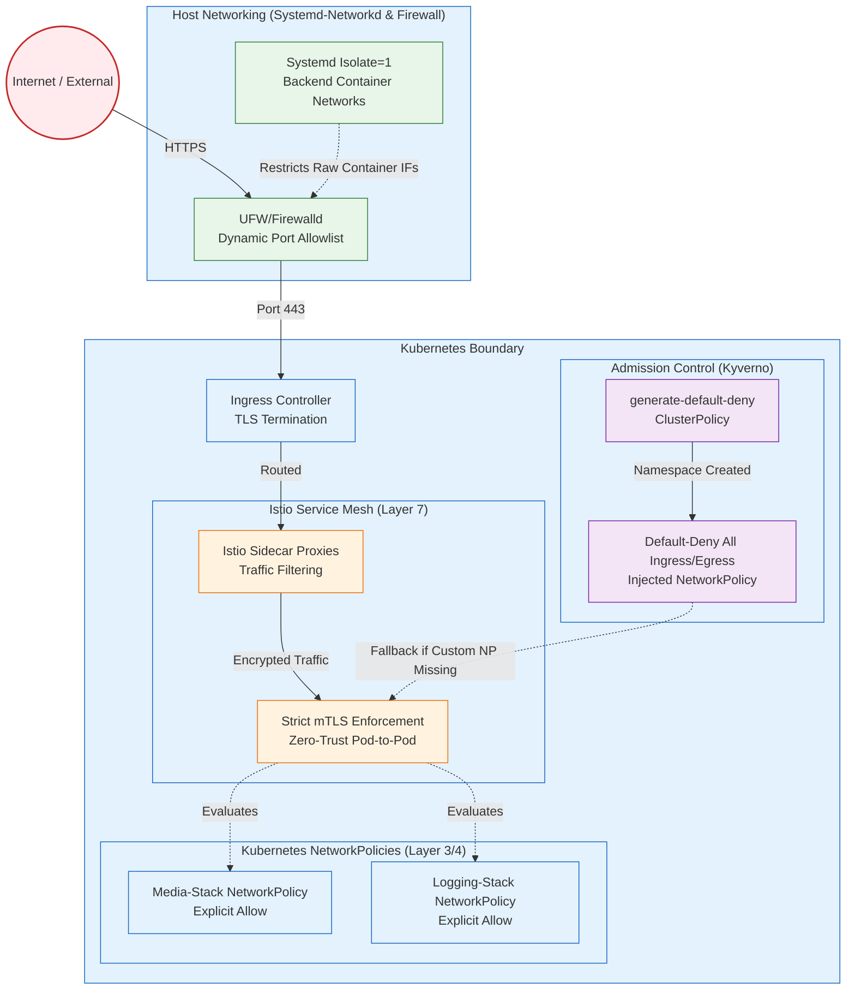

# Network Security Posture

This diagram illustrates the atomic layers of network security, from the host firewall up through the Kubernetes zero-trust mesh.

---

## 🛡️ Key Security Postures Illustrated

| Component | Responsibility | Protection Level |
|-----------|----------------|------------------|
| **UFW / Firewalld** | Drops unlisted physical/TCP traffic before hitting the cluster. | Host / Node |
| **Systemd Networks** | `isolate=1` physical definitions ensure backend docker/raw containers can't natively route out. | Host / Docker |
| **Istio Strict mTLS** | Enforces zero-trust cryptographic identity and encryption for all intra-cluster pod communications. | Service Mesh (L7) |
| **App NetworkPolicies** | Atomic policies natively bound to Helm charts for tight L3/L4 control. | Kubernetes (L3/L4) |
| **Kyverno Fail-safe** | Mutating admission controller that guarantees a default-deny NetworkPolicy exists in every namespace. | Cluster Global |
