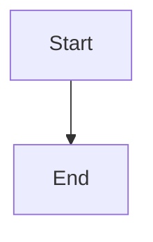

# Mermaid Diagrams Index
# =============================================================================
# Collection of all deployment matrix Mermaid diagrams
# Last Updated: 2026-02-28
# =============================================================================

## Overview

This directory contains Mermaid diagram files for visualizing the Deploy-System-Unified deployment matrix. Each file is a self-contained Markdown file with embedded Mermaid diagrams that can be rendered in:

- GitHub/GitLab Markdown viewers
- Mermaid Live Editor (https://mermaid.live)
- VS Code with Mermaid extension
- Documentation generators (MkDocs, Docusaurus, etc.)

---

## Diagram Files

### 1. Complete Stack Overview
**File:** `01_complete_stack_overview.md`

**Purpose:** Shows all 11 deployable stacks with their components, namespaces, and types

**Diagram Type:** Graph (Top-Bottom)

**Key Information:**
- 10 Kubernetes Helm charts
- 1 Podman container (Anubis)
- Stack priorities (P0, P1, P2)
- Basic dependencies

**Use Case:** Quick reference for all available stacks

---

### 2. Deployment Profiles
**File:** `02_deployment_profiles.md`

**Purpose:** Compares all 6 deployment profiles (A-F) with their stack selections

**Diagram Type:** Graph (Left-Right)

**Key Information:**
- Profile A: MINIMAL (2 stacks, 2 CPU, 4Gi)
- Profile B: STANDARD (8 stacks, 4 CPU, 8Gi)
- Profile C: PRODUCTION (11 stacks, 16+ CPU, 64Gi+)
- Profile D: MONITORING (4 stacks, 4 CPU, 16Gi)
- Profile E: MEDIA (4 stacks, 8+ CPU, 16Gi)
- Profile F: SECURITY (6 stacks, 8 CPU, 32Gi)

**Use Case:** Selecting the right profile for your use case

---

### 3. Stack Dependencies
**File:** `03_stack_dependencies.md`

**Purpose:** Shows dependency relationships between stacks

**Diagram Type:** Graph (Top-Bottom)

**Key Information:**
- Tier 0: No dependencies (8 stacks)
- Tier 1: Single dependency (2 stacks)
- Tier 2: Optional dependencies (1 stack)
- Required vs Optional dependencies

**Use Case:** Planning deployment order

---

### 4. Incompatibilities
**File:** `04_incompatibilities.md`

**Purpose:** Documents combinations that should NOT be deployed

**Diagram Type:** Graph (Top-Bottom)

**Key Information:**
- 5 Critical incompatibilities (NEVER DEPLOY)
- 7 High-risk combinations (NOT RECOMMENDED)
- 3 Moderate-risk combinations (USE WITH CAUTION)

**Use Case:** Avoiding deployment failures

---

### 5. Resource Requirements
**File:** `05_resource_requirements.md`

**Purpose:** Visual comparison of CPU, Memory, and Storage by profile

**Diagram Type:** XY Chart (Bar)

**Key Information:**
- CPU requirements per profile
- Memory requirements per profile
- Storage requirements per profile

**Use Case:** Capacity planning

---

### 6. Decision Tree
**File:** `06_decision_tree.md`

**Purpose:** Interactive decision tree for profile selection

**Diagram Type:** Graph (Top-Bottom)

**Key Information:**
- Decision points (Yes/No questions)
- Profile recommendations based on answers

**Use Case:** Helping users choose the right profile

---

### 7. Security Architecture
**File:** `07_security_architecture.md`

**Purpose:** Shows the 5-layer security model applied to all stacks

**Diagram Type:** Graph (Top-Bottom)

**Key Information:**
- Layer 1: Pod Security
- Layer 2: RBAC
- Layer 3: Network Security
- Layer 4: Secrets Management
- Layer 5: Monitoring & Audit

**Use Case:** Understanding security controls

---

### 8. Deployment Workflow
**File:** `08_deployment_workflow.md`

**Purpose:** Complete deployment workflow from planning to validation

**Diagram Type:** Sequence Diagram

**Key Information:**
- 5 deployment phases
- Validation checkpoints
- Post-deployment tasks

**Use Case:** Understanding the deployment process

---

### 9. Network Security Posture
**File:** `10_network_security_posture.md`

**Purpose:** Complete visualization of atomic networking defense layers (UFW, Kyverno, Istio)

**Diagram Type:** Graph (Top-Bottom)

**Key Information:**
- Host Net Policies (Systemd / UFW)
- Mesh Layer (Istio mTLS)
- Fail-Safe Admission (Kyverno)

**Use Case:** Demonstrating overall network security defense posture

---

## Usage Examples

### Render in GitHub/GitLab

All diagrams will automatically render in GitHub/GitLab Markdown viewers that support Mermaid.

### Render in Mermaid Live Editor

1. Open https://mermaid.live
2. Copy the mermaid code block from any file
3. Paste into the editor
4. Export as PNG/SVG if needed

### Render in VS Code

1. Install "Markdown Preview Mermaid Support" extension
2. Open any diagram file
3. Press `Ctrl+Shift+V` (or `Cmd+Shift+V` on Mac)
4. Toggle Mermaid view

### Embed in Documentation

```markdown

```

---

## Color Coding

| Color | Meaning | Used In |
|-------|---------|---------|
| 🔵 Blue | Kubernetes stacks / Layer 1 | Stack overview, Security architecture |
| 🔴 Red | Podman containers / Critical | Stack overview, Incompatibilities |
| 🟢 Green | Safe/Valid / Layer 2 | Profiles, Dependencies |
| 🟠 Orange | Warnings/Questions / Layer 3 | Decision tree, Incompatibilities |
| 🟡 Yellow | Moderate risk / Layer 4 | Incompatibilities |
| 🟣 Purple | Security/Advanced / Layer 5 | Security architecture |

**Note:** Colors are consistent across diagrams for easy recognition. Security layers use the same color scheme as the [Security Architecture](./07_security_architecture.md) diagram.

---

## File Naming Convention

```
NN_description.md
```

Where:
- `NN` = Two-digit sequence number (01-99)
- `description` = Snake_case description

**Example:** `01_complete_stack_overview.md`

---

## 🏷️ Diagram Audit Codes

Each diagram includes an **Audit Event Identifier** for forensic traceability and version tracking.

### Audit Code Format

```
DSU-MMD-NNNNNN
```

Where:
- `DSU` = Deploy-System-Unified
- `MMD` = Mermaid Diagram
- `NNNNNN` = 6-digit code (first 2 = category, last 4 = sequence)

### Category Mapping

| Code Range | Category | Files |
|------------|----------|-------|
| `10xxxx` | Stack Overview | `01_complete_stack_overview.md` |
| `11xxxx` | Deployment Profiles | `02_deployment_profiles.md` |
| `12xxxx` | Dependencies | `03_stack_dependencies.md` |
| `13xxxx` | Incompatibilities | `04_incompatibilities.md` |
| `14xxxx` | Resource Requirements | `05_resource_requirements.md` |
| `15xxxx` | Decision Tree | `06_decision_tree.md` |
| `16xxxx` | Security Architecture | `07_security_architecture.md`, `10_network_security_posture.md` |
| `17xxxx` | Deployment Workflow | `08_deployment_workflow.md` |
| `18xxxx` | Architecture Docs | `docs/architecture/*.md` |
| `19xxxx` | Role Documentation | `roles/*/readme.md` |

### Version Tracking

| Version | Mermaid Syntax | Renderer Support | Audit Code |
|---------|----------------|------------------|------------|
| **1.0** | `graph`, `sequenceDiagram` | GitHub, GitLab, All | `100001` |
| **1.1** | `classDef`, `linkStyle` | GitHub, GitLab, All | `100002` |
| **1.2** | `subgraph`, `-.->` | GitHub, GitLab, All | `100003` |
| **2.0** | `xychart-beta` | ⚠️ Limited (not GitHub) | `140001` (deprecated) |

### Compliance Mapping

| Standard | Audit Code | Purpose |
|----------|------------|---------|
| **ISO 27001 §12.4** | `100099` | Event logging and monitoring |
| **ISO 9001 §7.5** | `100098` | Documented information control |
| **DSU Internal** | `10xxxx` | Diagram version tracking |

---

## 🔄 Version Control Audit Codes

Special audit codes for tracking outdated diagrams and version migration.

### Deprecated Syntax Tracking

| Audit Code | Syntax | Status | Action Required | Replaced By |
|------------|--------|--------|-----------------|-------------|
| `DSU-MMD-990001` | `xychart-beta` | ❌ Deprecated | Replace with `graph LR` | `140002` |
| `DSU-MMD-990002` | `gantt` (old format) | ⚠️ Legacy | Update to v10+ syntax | N/A |
| `DSU-MMD-990003` | `classDef` (v8 syntax) | ⚠️ Legacy | Update to v10+ syntax | N/A |
| `DSU-MMD-990004` | `click` callbacks | ❌ Deprecated | Remove (security) | `linkStyle` |

### Version Migration Codes

| Audit Code | From Version | To Version | Migration Date | Files Affected |
|------------|--------------|------------|----------------|----------------|
| `DSU-MMD-991001` | Mermaid 9.x | Mermaid 10.x | 2026-02-28 | All diagrams |
| `DSU-MMD-991002` | xychart-beta | graph LR | 2026-02-28 | `05_resource_requirements.md` |

### Review Schedule Codes

| Audit Code | Review Type | Frequency | Next Review | Owner |
|------------|-------------|-----------|-------------|-------|
| `DSU-MMD-999001` | Syntax Validation | Quarterly | 2026-05-28 | Infrastructure Team |
| `DSU-MMD-999002` | Renderer Compatibility | Quarterly | 2026-05-28 | Infrastructure Team |
| `DSU-MMD-999003` | Content Accuracy | Bi-annual | 2026-08-28 | Architecture Team |
| `DSU-MMD-999004` | Security Review | Annual | 2027-02-28 | Security Team |

---

## 📊 Complete Audit Code Registry

| File | Audit Code | Category | Diagram Type |
|------|------------|----------|--------------|
| `README.md` (project root) | `DSU-MMD-100000` | Project Structure | graph |
| `01_complete_stack_overview.md` | `DSU-MMD-100001` | Stack Overview | graph |
| `02_deployment_profiles.md` | `DSU-MMD-110001` | Deployment Profiles | graph |
| `03_stack_dependencies.md` | `DSU-MMD-120001` | Dependencies | graph |
| `04_incompatibilities.md` | `DSU-MMD-130001` | Incompatibilities | graph |
| `05_resource_requirements.md` | `DSU-MMD-140002` | Resource Requirements | graph (LR) |
| `06_decision_tree.md` | `DSU-MMD-150001` | Decision Tree | graph |
| `07_security_architecture.md` | `DSU-MMD-160001` | Security Architecture | graph |
| `10_network_security_posture.md` | `DSU-MMD-160002` | Network Security | graph |
| `08_deployment_workflow.md` | `DSU-MMD-170001` | Deployment Workflow | sequenceDiagram |
| `docs/architecture/SECURITY_LAYERS.md` | `DSU-MMD-180001` | Security Layers | graph |
| `docs/architecture/NETWORK_TOPOLOGY.md` | `DSU-MMD-180002` | Network Topology | graph |
| `docs/architecture/FORENSIC_FLOW.md` | `DSU-MMD-180003` | Forensic Flow | graph |
| `docs/architecture/BOOT_LIFECYCLE.md` | `DSU-MMD-180004` | Boot Lifecycle | graph |
| `docs/architecture/DEPLOYMENT_COMBINATIONS.md` | `DSU-MMD-180005` | Deployment Combinations | graph |
| `docs/architecture/CROSS_RUNTIME_MATRIX.md` | `DSU-MMD-180006` | Cross-Runtime Matrix | graph |
| `docs/architecture/STORAGE_INTERACTION_MATRIX.md` | `DSU-MMD-180007` | Storage Interaction | graph |
| `docs/benchmarks/BASELINE_REFERENCE_GRAPH.md` | `DSU-MMD-180008` | Baseline Reference | graph |
| `wiki_pages/MODULAR_LAYERS.md` | `DSU-MMD-190001` | Modular Layers | graph |
| `roles/core/readme.md` | `DSU-MMD-190002` | Core Role | graph |
| `roles/containers/readme.md` | `DSU-MMD-190003` | Containers Role | graph |
| `roles/security/readme.md` | `DSU-MMD-190004` | Security Role | graph |
| `roles/README.md` | `DSU-MMD-190005` | Roles Architecture | graph |

---

## Version History

| Version | Date | Changes |
|---------|------|---------|
| 1.0 | 2026-02-28 | Initial release with 8 diagrams |

---

## Related Documentation

### Deployment Matrix Documentation
- [DEPLOYMENT_MATRIX.md](../DEPLOYMENT_MATRIX.md) - Complete text-based matrix
- [DEPLOYMENT_QUICK_REFERENCE.md](../DEPLOYMENT_QUICK_REFERENCE.md) - One-page reference
- [PRODUCTION_RUNBOOK.md](../PRODUCTION_RUNBOOK.md) - Step-by-step deployment guide
- [VERSION_CONTROL.md](./VERSION_CONTROL.md) - **Version audit codes & migration tracking**

### Architecture Documentation
- [Security Layers](../../architecture/SECURITY_LAYERS.md) - 5-layer security model
- [Network Topology](../../architecture/NETWORK_TOPOLOGY.md) - Data flow diagram
- [Boot Lifecycle](../../architecture/BOOT_LIFECYCLE.md) - System boot sequence
- [Forensic Flow](../../architecture/FORENSIC_FLOW.md) - Audit event flow

### Compliance & Security
- [SECURITY_STANDARDS.md](../../security/SECURITY_STANDARDS.md) - Security requirements
- [MODULAR_LAYERS.md](../../../wiki_pages/MODULAR_LAYERS.md) - Role-to-layer mapping

---

**End of Mermaid Diagrams Index**
