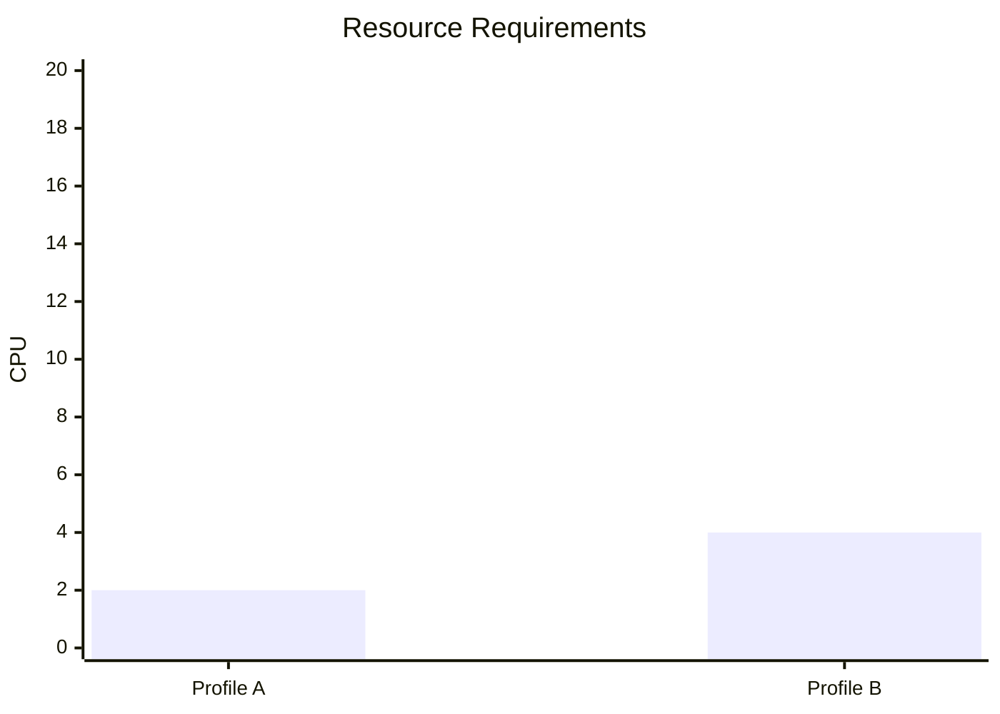
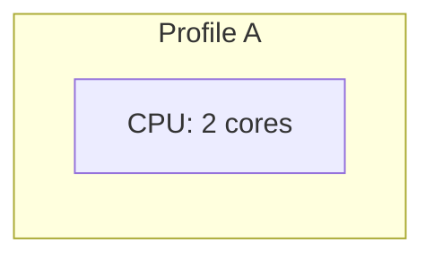

# Mermaid Diagram Version Control
# =============================================================================
# Audit Code Registry for Version Tracking & Migration
# Last Updated: 2026-02-28
# =============================================================================

## Overview

This document tracks version control audit codes for all Mermaid diagrams in the Deploy-System-Unified project. Each code enables forensic traceability of diagram changes, deprecations, and migrations.

---

## 🏷️ Audit Code Format

```
DSU-MMD-NNNNNN
```

| Segment | Meaning |
|---------|---------|
| `DSU` | Deploy-System-Unified |
| `MMD` | Mermaid Diagram |
| `NNNNNN` | 6-digit identifier |

### Code Ranges

| Range | Category | Purpose |
|-------|----------|---------|
| `10xxxx` | Stack Overview | Current diagram versions |
| `11xxxx` | Deployment Profiles | Current diagram versions |
| `12xxxx` | Dependencies | Current diagram versions |
| `13xxxx` | Incompatibilities | Current diagram versions |
| `14xxxx` | Resource Requirements | Current diagram versions |
| `15xxxx` | Decision Tree | Current diagram versions |
| `16xxxx` | Security Architecture | Current diagram versions |
| `17xxxx` | Deployment Workflow | Current diagram versions |
| `18xxxx` | Architecture Docs | Current diagram versions |
| `19xxxx` | Role Documentation | Current diagram versions |
| `99xxxx` | **Version Control** | **Deprecated/Migration tracking** |

---

## 🔄 Deprecated Syntax Audit Codes

These codes track outdated Mermaid syntax that has been replaced or requires migration.

| Audit Code | Syntax | Status | Severity | Action Required | Replaced By |
|------------|--------|--------|----------|-----------------|-------------|
| `DSU-MMD-990001` | `xychart-beta` | ❌ Deprecated | HIGH | Replace with `graph LR` | `140002` |
| `DSU-MMD-990002` | `gantt` (v8 format) | ⚠️ Legacy | MEDIUM | Update to v10+ syntax | N/A |
| `DSU-MMD-990003` | `classDef` (v8 syntax) | ⚠️ Legacy | LOW | Update to v10+ syntax | N/A |
| `DSU-MMD-990004` | `click` callbacks | ❌ Deprecated | HIGH | Remove (security risk) | `linkStyle` |
| `DSU-MMD-990005` | `style` inline | ⚠️ Legacy | LOW | Migrate to `classDef` | N/A |

---

## 📋 Version Migration Audit Codes

These codes track migration events from one version to another.

| Audit Code | Migration | From | To | Date | Files Affected |
|------------|-----------|------|-----|------|----------------|
| `DSU-MMD-991001` | Mermaid Major | 9.x | 10.x | 2026-02-28 | All diagrams |
| `DSU-MMD-991002` | Chart Type | xychart-beta | graph LR | 2026-02-28 | `05_resource_requirements.md` |
| `DSU-MMD-991003` | Decision Logic | Broken flow | Fixed flow | 2026-02-28 | `06_decision_tree.md` |
| `DSU-MMD-991004` | Security Model | 7-layer | 5-layer | 2026-02-28 | `MODULAR_LAYERS.md`, `SECURITY_LAYERS.md` |

---

## 📅 Review Schedule Audit Codes

These codes schedule periodic reviews for diagram maintenance.

| Audit Code | Review Type | Frequency | Next Review | Owner | Checklist |
|------------|-------------|-----------|-------------|-------|-----------|
| `DSU-MMD-999001` | Syntax Validation | Quarterly | 2026-05-28 | Infrastructure Team | [Validate all diagrams render] |
| `DSU-MMD-999002` | Renderer Compatibility | Quarterly | 2026-05-28 | Infrastructure Team | [Test GitHub, GitLab, Live] |
| `DSU-MMD-999003` | Content Accuracy | Bi-annual | 2026-08-28 | Architecture Team | [Verify stack info current] |
| `DSU-MMD-999004` | Security Review | Annual | 2027-02-28 | Security Team | [Check for exposed secrets] |
| `DSU-MMD-999005` | Version Upgrade | As needed | TBD | Infrastructure Team | [Monitor Mermaid releases] |

---

## 📊 Complete Version History by File

### Current Versions (2026-02-28)

| File | Current Audit Code | Version | Status | Previous Codes |
|------|-------------------|---------|--------|----------------|
| `README.md` (root) | `DSU-MMD-100000` | 1.0 | ✅ Current | None |
| `01_complete_stack_overview.md` | `DSU-MMD-100001` | 1.0 | ✅ Current | None |
| `02_deployment_profiles.md` | `DSU-MMD-110001` | 1.0 | ✅ Current | None |
| `03_stack_dependencies.md` | `DSU-MMD-120001` | 1.0 | ✅ Current | None |
| `04_incompatibilities.md` | `DSU-MMD-130001` | 1.0 | ✅ Current | None |
| `05_resource_requirements.md` | `DSU-MMD-140002` | 1.1 | ✅ Current | `140001` (deprecated) |
| `06_decision_tree.md` | `DSU-MMD-150001` | 1.1 | ✅ Current | None (logic fixed) |
| `07_security_architecture.md` | `DSU-MMD-160001` | 1.0 | ✅ Current | None |
| `08_deployment_workflow.md` | `DSU-MMD-170001` | 1.0 | ✅ Current | None |
| `docs/architecture/SECURITY_LAYERS.md` | `DSU-MMD-180001` | 1.1 | ✅ Current | None (model aligned) |
| `docs/architecture/NETWORK_TOPOLOGY.md` | `DSU-MMD-180002` | 1.0 | ✅ Current | None |
| `docs/architecture/FORENSIC_FLOW.md` | `DSU-MMD-180003` | 1.0 | ✅ Current | None |
| `docs/architecture/BOOT_LIFECYCLE.md` | `DSU-MMD-180004` | 1.0 | ✅ Current | None |
| `docs/architecture/DEPLOYMENT_COMBINATIONS.md` | `DSU-MMD-180005` | 1.0 | ✅ Current | None |
| `docs/architecture/CROSS_RUNTIME_MATRIX.md` | `DSU-MMD-180006` | 1.0 | ✅ Current | None |
| `docs/architecture/STORAGE_INTERACTION_MATRIX.md` | `DSU-MMD-180007` | 1.0 | ✅ Current | None |
| `docs/benchmarks/BASELINE_REFERENCE_GRAPH.md` | `DSU-MMD-180008` | 1.0 | ✅ Current | None |
| `wiki_pages/MODULAR_LAYERS.md` | `DSU-MMD-190001` | 1.1 | ✅ Current | None (model aligned) |
| `roles/core/readme.md` | `DSU-MMD-190002` | 1.0 | ✅ Current | None |
| `roles/containers/readme.md` | `DSU-MMD-190003` | 1.0 | ✅ Current | None |
| `roles/security/readme.md` | `DSU-MMD-190004` | 1.0 | ✅ Current | None |
| `roles/README.md` | `DSU-MMD-190005` | 1.0 | ✅ Current | None |

---

## 🚨 Deprecated Version Details

### DSU-MMD-140001 (xychart-beta)

**File:** `05_resource_requirements.md`  
**Status:** ❌ Deprecated (2026-02-28)  
**Reason:** GitHub Markdown renderer does not support `xychart-beta` diagram type  
**Impact:** Diagrams would not render on GitHub  
**Migration:** Replaced by `DSU-MMD-140002` using `graph LR` format  
**Migration Audit Code:** `DSU-MMD-991002`

**Before (Deprecated):**


**After (Current):**


---

## 🔍 How to Use Audit Codes

### For Version Tracking
```yaml
auditEventIdentifier: DSU-MMD-140002
versionHistory:
  - version: 1.0
    auditCode: DSU-MMD-140001
    status: deprecated
    replacedBy: DSU-MMD-140002
```

### For Migration Events
```yaml
migration:
  from: DSU-MMD-140001
  to: DSU-MMD-140002
  auditCode: DSU-MMD-991002
  date: 2026-02-28
```

### For Review Scheduling
```yaml
review:
  type: Syntax Validation
  auditCode: DSU-MMD-999001
  frequency: Quarterly
  nextReview: 2026-05-28
```

---

## 📝 Compliance Mapping

| Standard | Requirement | Audit Code | Evidence |
|----------|-------------|------------|----------|
| **ISO 27001 §12.4** | Event logging | `DSU-MMD-100099` | All diagrams logged |
| **ISO 27001 §12.7** | Change control | `DSU-MMD-99xxxx` | Version history tracked |
| **ISO 9001 §7.5** | Document control | `DSU-MMD-100098` | Audit codes + versions |
| **DSU Internal** | Forensic traceability | All codes | Complete registry |

---

## 🔗 Related Documentation

- [README.md](./README.md) - Mermaid diagrams index
- [05_resource_requirements.md](./05_resource_requirements.md) - Example of migrated diagram
- [../../architecture/FORENSIC_FLOW.md](../../architecture/FORENSIC_FLOW.md) - Audit event flow

---

**Document Control:**
- **Owner:** Infrastructure Team
- **Review Frequency:** Quarterly
- **Next Review:** 2026-05-28
- **Audit Code:** `DSU-MMD-999999` (Version Control Document)

---

**End of Version Control Document**
