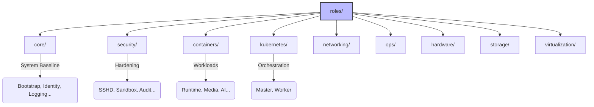

# Roles Architecture

**Audit Event Identifier:** DSU-MMD-190005  
**Mermaid Version:** 1.2  
**Renderer Support:** GitHub, GitLab, Mermaid Live  
**Last Updated:** 2026-02-28  

This directory contains all the Ansible roles used in the Deploy-System-Unified project, organized logically by domain.

## Organization Map

