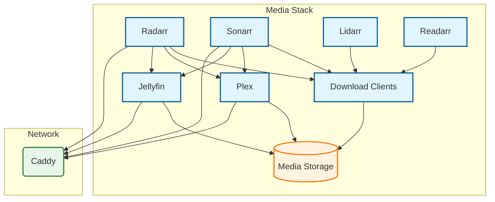

# Media Role

**Audit Event Identifier:** DSU-PLY-100090  
**Mermaid Version:** 1.2  
**Renderer Support:** GitHub, GitLab, Mermaid Live  
**Last Updated:** 2026-03-01  

This role deploys a complete media streaming and management stack, including Jellyfin, Plex, and the *Arr suite.

## Architecture



## Features
- **Streaming**: Jellyfin and Plex media servers.
- **Management**: Radarr (Movies), Sonarr (TV), Lidarr (Music), Readarr (Books).
- **Requests**: Jellyseerr for unified media requests.
- **Downloads**: Transmission and other download clients.
- **Multi-Tenancy**: Support for multiple users and libraries.

## Usage

```yaml
- name: Deploy Media Stack
  hosts: media_nodes
  roles:
    - containers/media
```
