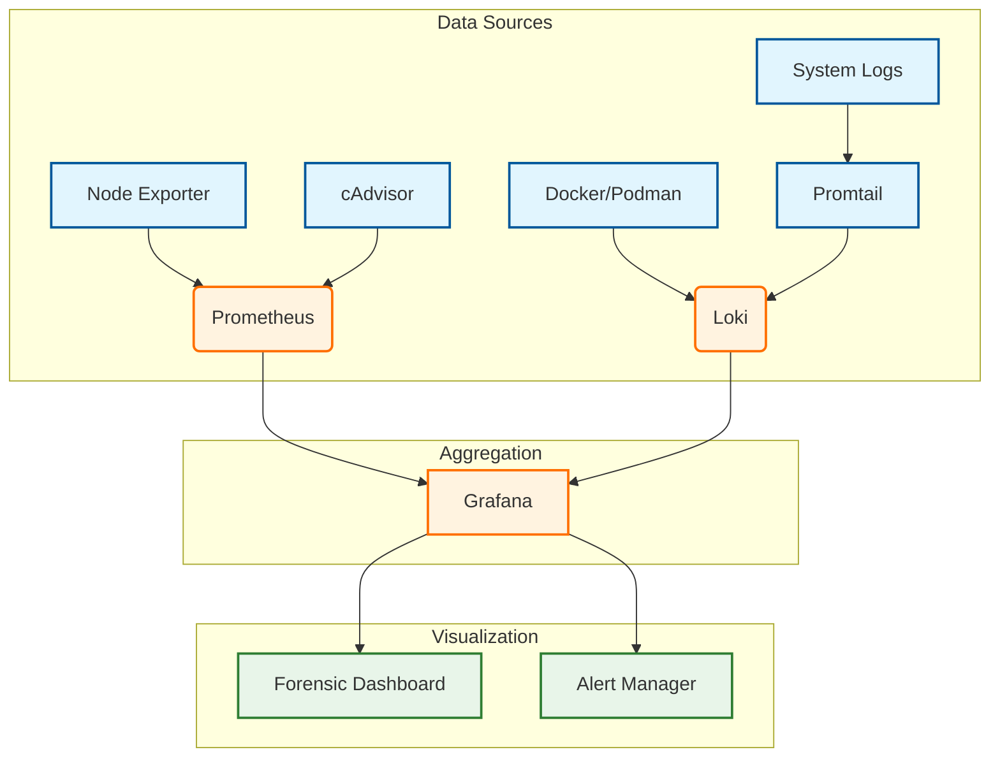

# Monitoring Role

**Audit Event Identifier:** DSU-PLY-100107  
**Mermaid Version:** 1.2  
**Renderer Support:** GitHub, GitLab, Mermaid Live  
**Last Updated:** 2026-03-01  

This role deploys a comprehensive observability stack, including Prometheus for metrics, Grafana for visualization, and Loki for forensic log aggregation.

## Architecture



## Features
- **Prometheus**: Time-series database for metrics.
- **Grafana**: Operational and forensic dashboards.
- **Loki**: Log aggregation system (like Prometheus, but for logs).
- **Forensic Ready**: Pre-configured dashboards for audit event tracking.
- **Gatus**: Automated health checking and status page.

## Usage

```yaml
- name: Deploy Monitoring Stack
  hosts: container_nodes
  roles:
    - containers/monitoring
```
