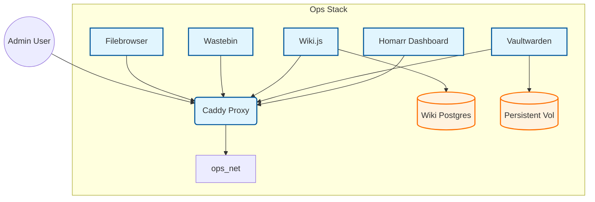

# Ops Role

**Audit Event Identifier:** DSU-PLY-100026  
**Mermaid Version:** 1.2  
**Renderer Support:** GitHub, GitLab, Mermaid Live  
**Last Updated:** 2026-03-01  

This role deploys operational support containers including dashboards, password managers, and documentation wikis.

## Architecture



## Features
- **Homarr**: Centralized dashboard for all services.
- **Vaultwarden**: Self-hosted Bitwarden compatible password manager.
- **Wiki.js**: Documentation platform (Postgres backend).
- **Wastebin**: Minimalist pastebin.
- **Filebrowser**: Web-based file manager.

## Usage

```yaml
- name: Deploy Ops Stack
  hosts: container_nodes
  roles:
    - containers/ops
```
