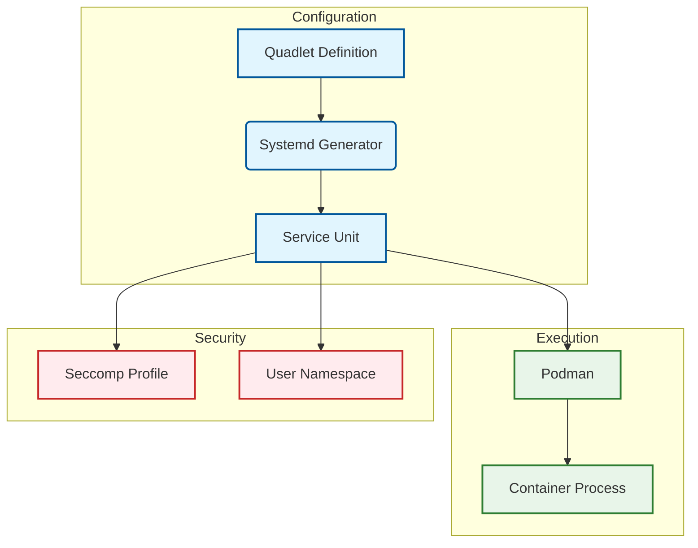

# Quadlets Role

**Audit Event Identifier:** DSU-PLY-100117  
**Mermaid Version:** 1.2  
**Renderer Support:** GitHub, GitLab, Mermaid Live  
**Last Updated:** 2026-03-01  

This role manages the deployment of Podman Quadlet files, which allow Systemd to natively manage containers as services.

## Architecture



## Features
- **Native Integration**: Treat containers like standard system services.
- **Dependency Management**: Define startup order and dependencies using Systemd logic.
- **Rootless Support**: Seamless deployment of user-scoped Quadlets.
- **Auto-Updates**: Integration with Podman Auto-Update for image freshness.

## Usage

```yaml
- name: Deploy Quadlets
  hosts: container_nodes
  roles:
    - containers/quadlets
```
