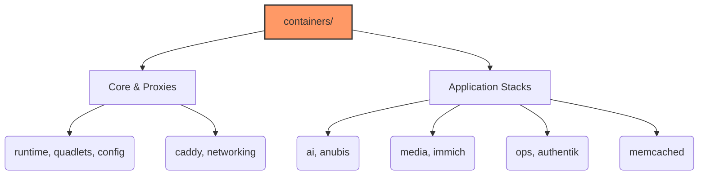

# Containers Role

**Audit Event Identifier:** DSU-MMD-190003  
**Mermaid Version:** 1.2  
**Renderer Support:** GitHub, GitLab, Mermaid Live  
**Last Updated:** 2026-02-28  

This role manages container runtimes and orchestration tools.

## Sub-Components



* **[runtime](runtime/readme.md)**: Installs and configures Podman/Docker runtimes. **(New: Includes Rate-Limit Protections)**
* **config**: General container configuration (registries, storage).
* **monitoring**: Prometheus & Grafana stack (Quadlets).
* **caddy**: Caddy web server setup (often used as a reverse proxy for containers).
* **memcached**: Distributed memory object caching system (Podman Quadlet).
* **media**: Media streaming stack (Jellyfin, Plex, *Arr suite, Transmission). Supports multi-tenancy.
* **ops**: Operational tools (Homarr Dashboard, Vaultwarden, Wiki.js).
* **authentik**: Identity Provider stack (Server, Worker, Redis, Postgres).
* **quadlets**: Systemd generator for Podman containers.
* **anubis**: Specific containerized service configuration.
* **lxc**: LXC (Linux Containers) setup and configuration.

## Usage

```yaml
- name: Setup Container Environment
  hosts: container_nodes
  roles:
    - containers
```
