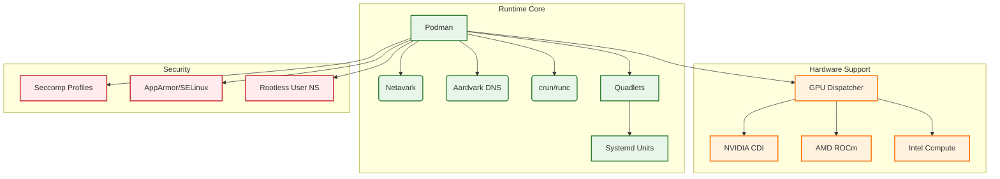

# Runtime Role

**Audit Event Identifier:** DSU-PLY-100130  
**Mermaid Version:** 1.2  
**Renderer Support:** GitHub, GitLab, Mermaid Live  
**Last Updated:** 2026-03-01  

This role installs and configures the core container runtime environment, including Podman, Netavark, and GPU support.

## Architecture



## Features
- **Podman**: Daemonless container engine.
- **Rootless**: Full rootless container support via user namespaces.
- **Quadlets**: Native Systemd integration for containers.
- **GPU Support**: Auto-detection and configuration for NVIDIA, AMD, and Intel.
- **Security**: Hardened defaults, Seccomp profiles, and AppArmor/SELinux integration.

## Usage

```yaml
- name: Setup Container Runtime
  hosts: all
  roles:
    - containers/runtime
```
