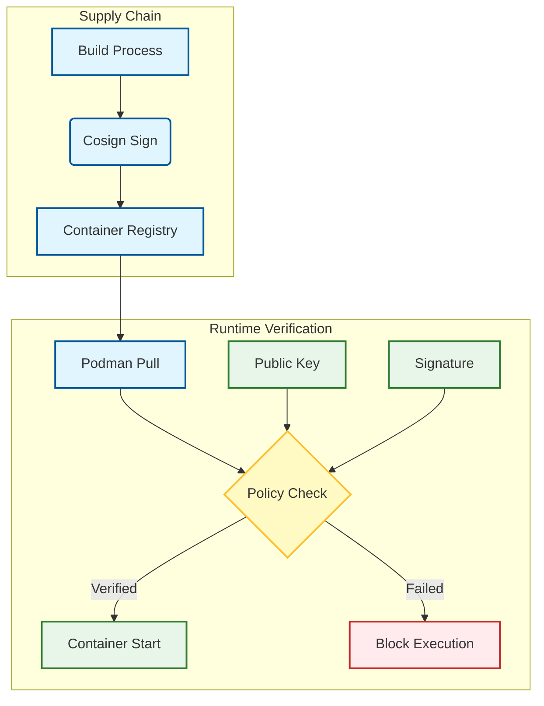

# Signing Role

**Audit Event Identifier:** DSU-PLY-100160  
**Mermaid Version:** 1.2  
**Renderer Support:** GitHub, GitLab, Mermaid Live  
**Last Updated:** 2026-03-01  

This role implements container image signing and verification using Cosign, ensuring supply chain integrity.

## Architecture



## Features
- **Cosign**: Industry-standard container signing tool.
- **Policy Enforcement**: Configuration of `policy.json` to reject unsigned images.
- **Key Management**: Secure distribution of public verification keys.
- **Automation**: Integration with CI/CD pipelines for automatic signing.

## Usage

```yaml
- name: Setup Image Signing
  hosts: container_nodes
  roles:
    - containers/signing
```
