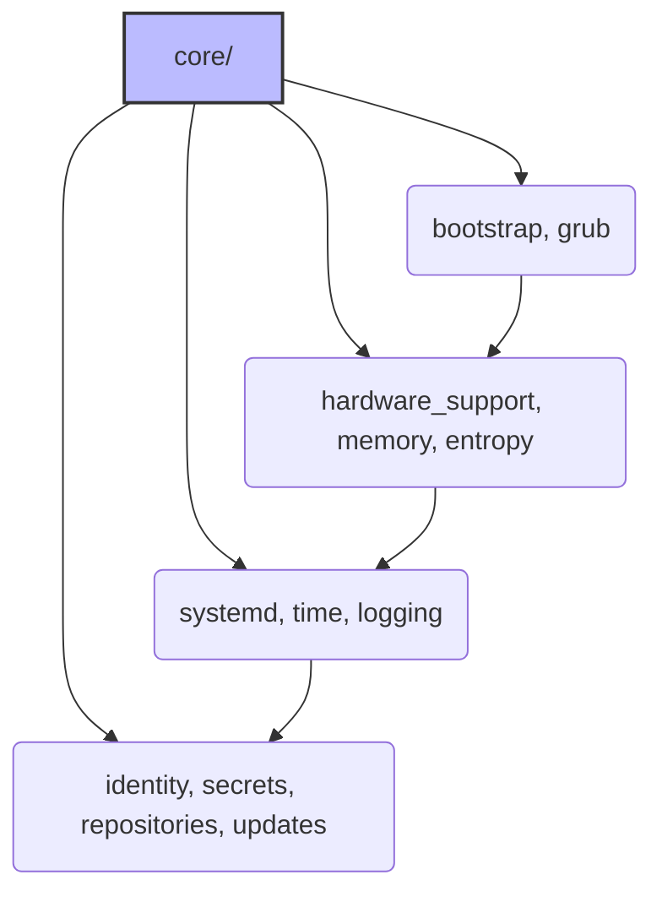

# Core Role

**Audit Event Identifier:** DSU-MMD-190002  
**Mermaid Version:** 1.2  
**Renderer Support:** GitHub, GitLab, Mermaid Live  
**Last Updated:** 2026-02-28  

This is the foundational role for the Deploy-System-Unified project. It aggregates essential system configuration tasks that must be applied to all nodes.

## Sub-Components



This role imports tasks from the following sub-directories:

* **bootstrap**: Initial system bootstrapping.
* **identity**: User and group management.
* **memory**: Intelligent memory management (ZRAM/ZSwap strategies).
* **systemd**: Systemd service configuration.
* **time**: NTP and timezone configuration.
* **entropy**: Entropy generation services.
* **secrets**: Secret management (SOPS/Vault).
* **repositories**: Package repository configuration.
* **logging**: System logging configuration.
* **updates**: System update management.

## Usage

This role is typically imported in the main playbook or site-wide configuration.

```yaml
- name: Apply Core Configuration
  hosts: all
  roles:
    - core
```

## Tags

All tasks are tagged with `core` and their specific sub-component name (e.g., `core`, `bootstrap`).
