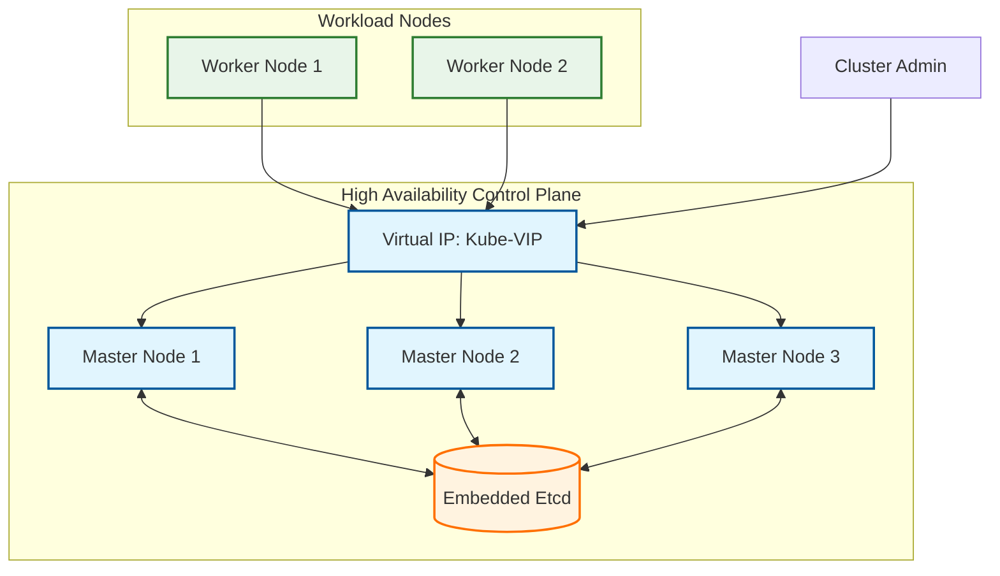

# K3s Master Role

**Audit Event Identifier:** DSU-PLY-100583  
**Mermaid Version:** 1.2  
**Renderer Support:** GitHub, GitLab, Mermaid Live  
**Last Updated:** 2026-03-01  

This role deploys and configures the K3s control plane, supporting both standalone and high-availability (HA) modes.

## Architecture (HA Mode)



## Features
- **HA Ready**: Automated etcd-backed control plane scaling.
- **Floating IP**: Integrated Kube-VIP for seamless master failover.
- **Declarative**: Fully managed via `/etc/rancher/k3s/config.yaml`.
- **Security**: Hardened TLS SANs and automated token orchestration.

## Usage

```yaml
- name: Deploy HA K3s Master
  hosts: masters
  roles:
    - kubernetes/master
```
