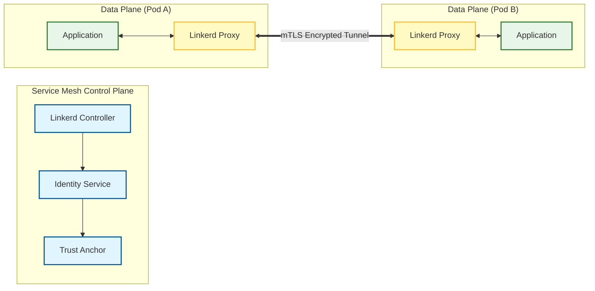

# Service Mesh Role

**Audit Event Identifier:** DSU-PLY-100900  
**Mermaid Version:** 1.2  
**Renderer Support:** GitHub, GitLab, Mermaid Live  
**Last Updated:** 2026-03-01  

This role deploys and configures a lightweight service mesh (Linkerd) for the K3s cluster, enabling automatic mTLS and service observability.

## Architecture



## Features
- **Automatic mTLS**: Transparent service-to-service encryption.
- **Ultra-Lightweight**: Rust-based proxies optimized for K3s edge nodes.
- **Observability**: Real-time golden metrics (Success rate, Latency, Throughput).
- **Security**: Automated certificate rotation and strict identity verification.

## Usage

```yaml
- name: Deploy Service Mesh
  hosts: master
  roles:
    - kubernetes/service_mesh
```
