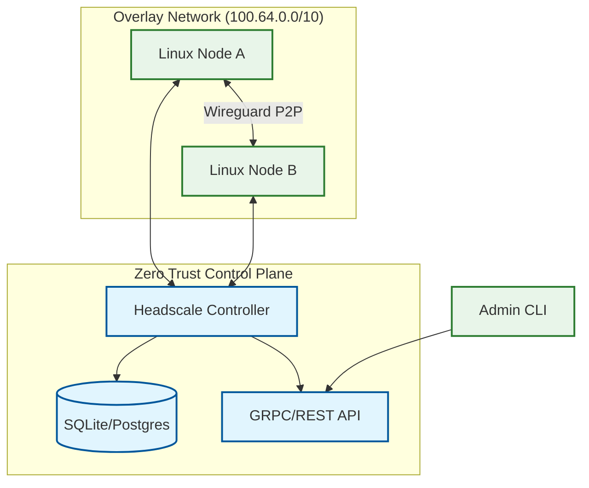

# Headscale Role

**Audit Event Identifier:** DSU-PLY-100800  
**Mermaid Version:** 1.2  
**Renderer Support:** GitHub, GitLab, Mermaid Live  
**Last Updated:** 2026-03-01  

This role deploys and configures the Headscale controller, an open-source, self-hosted implementation of the Tailscale control server.

## Architecture



## Features
- **Self-Hosted**: Full control over your coordination server.
- **MagicDNS**: Internal DNS resolution for the tailnet.
- **Namespace Isolation**: Segment nodes into logical namespaces.
- **Hardened**: Runs as a dedicated system user with strict directory permissions.

## Usage

```yaml
- name: Deploy Headscale Controller
  hosts: management_nodes
  roles:
    - security/headscale
```
