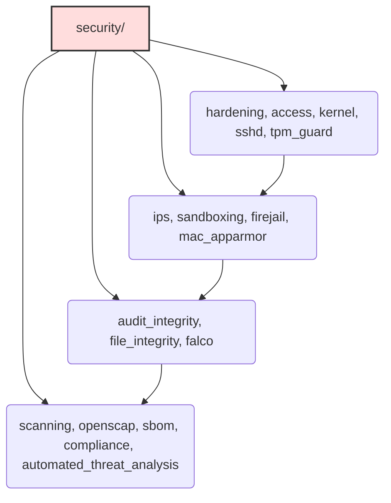

# Security Role

**Audit Event Identifier:** DSU-MMD-190004  
**Mermaid Version:** 1.2  
**Renderer Support:** GitHub, GitLab, Mermaid Live  
**Last Updated:** 2026-02-28  

This role implements the security baseline for the infrastructure. It aggregates various hardening and security configuration tasks.

## Sub-Components



This role imports tasks from the following sub-components:

* **access**: Application of access control lists (ACLs).
* **hardening**: Core system hardening (permissions, auditd).
* **sshd**: Secure SSH configuration.
* **secrets**: Security-specific secret handling.
* **kernel**: Kernel parameter tuning (sysctl).
* **firejail**: Application sandboxing via Firejail.
* **ips**: Intrusion Prevention Systems (Fail2Ban, etc.).
* **file_integrity**: File integrity monitoring.
* **audit_integrity**: Audit system configuration.
* **scanning**: Vulnerability scanning tools.

## Usage

Ensure this role is applied early in the provisioning process to secure the node.

```yaml
- name: Apply Security Baseline
  hosts: all
  roles:
    - security
```

## Configuration

Refer to the `defaults/main.yml` in each sub-component for specific tunable variables.
