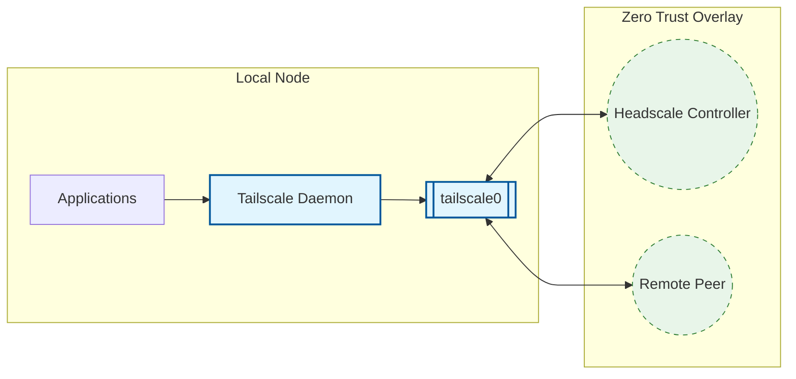

# Tailscale Client Role

**Audit Event Identifier:** DSU-PLY-100810  
**Mermaid Version:** 1.2  
**Renderer Support:** GitHub, GitLab, Mermaid Live  
**Last Updated:** 2026-03-01  

This role installs and configures the Tailscale client, connecting nodes to the Headscale Zero Trust overlay network.

## Architecture



## Features
- **Automated Registration**: Uses pre-auth keys for seamless join.
- **Expert Hardening**: Implements `dpkg hold` and JSON status validation.
- **Resilient**: Configured with automated retries for flaky connections.
- **Identity Tags**: Automatically advertises node tags for ACL enforcement.

## Usage

```yaml
- name: Join Zero Trust Mesh
  hosts: all
  roles:
    - security/tailscale
```
