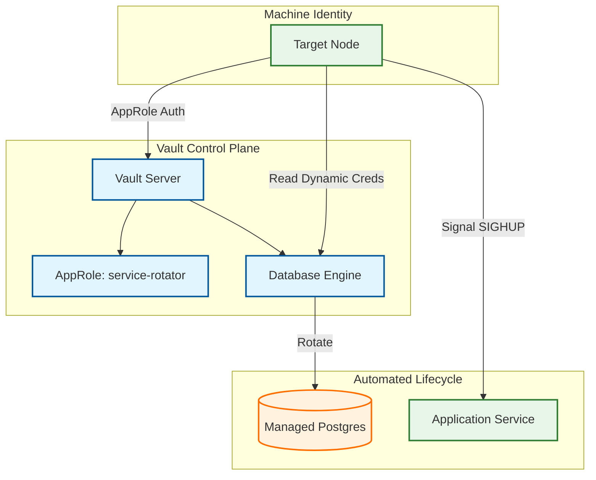

# Vault Integration Role

**Audit Event Identifier:** DSU-PLY-110056  
**Mermaid Version:** 1.2  
**Renderer Support:** GitHub, GitLab, Mermaid Live  
**Last Updated:** 2026-03-01  

This role provides HashiCorp Vault integration, supporting automated secret rotation, machine identity (AppRole), and Kubernetes-native secret injection.

## Architecture (Secret Rotation Lifecycle)



## Features
- **Standalone Vault Installation**: Secure setup with dedicated system user and hardened directory permissions.
- **Automated Rotation**: Policies and AppRoles for hands-free credential management.
- **Kubernetes Native**: Integrated agent injector for automatic sidecar-based secrets.
- **Dynamic Credentials**: On-demand generation of temporary database access.

## Usage

```yaml
- name: Setup Vault Infrastructure
  hosts: security_nodes
  roles:
    - security/vault_integration
```

## Tags
- `security`
- `secrets`
- `vault`
- `rotation`

## Compliance
- **ISO 27001 §9.3**: Use of secret authentication information.
- **NIST 800-53 SC-28**: Protection of information at rest.
- **NIST 800-53 IA-4**: Identifier Management.
