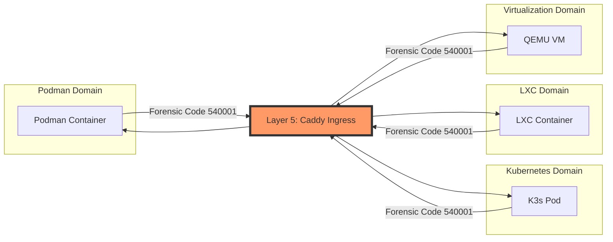

# Cross-Runtime Network Interaction Matrix

**Audit Event Identifier:** DSU-MMD-180006  
**Mermaid Version:** 1.2  
**Renderer Support:** GitHub, GitLab, Mermaid Live  
**Last Updated:** 2026-02-28  
**Compliance:** ISO 27001 §8.22 / NIST SC-7  

This document maps the security boundaries, communication methods, and forensic risks for every combination of container and virtualization runtime supported by **Deploy-System-Unified**.

---

## 📊 Interaction Matrix

| From \ To | **Podman** | **K3s / K8s** | **LXC / LXD** | **QEMU / KVM** |
| :--- | :--- | :--- | :--- | :--- |
| **Podman** | Internal Bridge (L3) | **Caddy Ingress (L7)** | **Caddy Ingress (L7)** | **Caddy Ingress (L7)** |
| **K3s / K8s** | **Caddy Ingress (L7)** | CNI Overlay (VXLAN) | **Caddy Ingress (L7)** | **Caddy Ingress (L7)** |
| **LXC / LXD** | **Caddy Ingress (L7)** | **Caddy Ingress (L7)** | Bridge / Macvlan | **Caddy Ingress (L7)** |
| **QEMU / KVM** | **Caddy Ingress (L7)** | **Caddy Ingress (L7)** | **Caddy Ingress (L7)** | Tap / Bridge |

### 🔑 Legend
- **Internal**: Native runtime communication (High Trust).
- **Caddy Ingress (L7)**: **Mandatory Gate**. All cross-runtime traffic MUST be proxied through Caddy to maintain forensic visibility and Forward-Auth protection.
- **Overlay/Bridge**: Standard L2/L3 networking within the same runtime family.

---

## 🛡️ Security Enforcement Logic (The "One-Way" Rule)

To prevent **"Runtime Bleed"**, the following forensic rules are enforced:

---

## 🚨 Risk Assessment per Combination

### 1. Podman ↔ K3s
- **Communication**: Via `deploy-net` bridge or Host-Loopback.
- **Forensic Risk**: HIGH if direct IP communication is used.
- **Mitigation**: Force through `service.internal` Caddy endpoint.

### 2. LXC ↔ Podman
- **Communication**: Typically shares the host bridge (`br0`).
- **Forensic Risk**: MEDIUM. LXC can sniff Podman bridge traffic if not isolated.
- **Mitigation**: Use separate VLANs for `lxcbr0` and `podman0`.

### 3. QEMU ↔ Any Container
- **Communication**: VM-to-Host-to-Container.
- **Forensic Risk**: LOW. Strongest isolation boundary.
- **Mitigation**: Ensure VM traffic passes through the host firewall (Layer 1) before reaching Caddy.

---

*Verified by: DSU Network Architect*  
*Compliance: ISO 27001 §8.22 / NIST SC-7*
