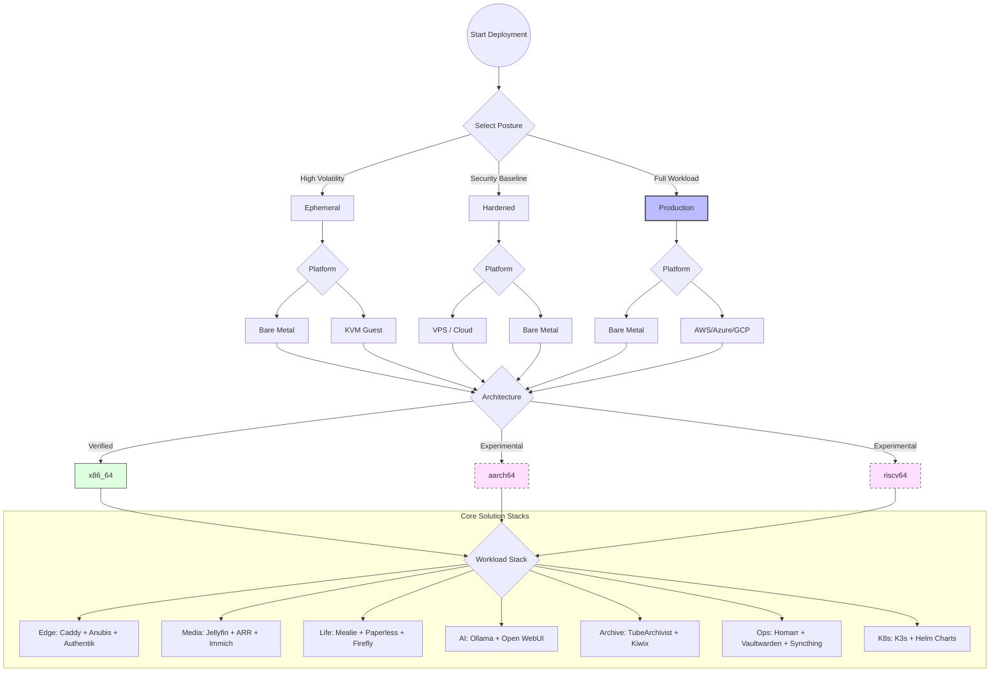

# Master Deployment Combination Matrix

**Audit Event Identifier:** DSU-MMD-180005  
**Mermaid Version:** 1.2  
**Renderer Support:** GitHub, GitLab, Mermaid Live  
**Last Updated:** 2026-02-28  
**Compliance:** ISO 9001 / ISO 27001 §17.1  

This document provides a visual guide to the supported and experimental combinations within the **Deploy-System-Unified** ecosystem.

---

## 🛰️ Deployment Decision Tree

This diagram maps the path from selecting a security posture to the final application workload.

---

## 📊 Compatibility & Support Matrix

| Dimension | Option | Audit Log Retention Class | Status | Testing Status |
| :--- | :--- | :--- | :--- | :--- |
| **Posture** | `ephemeral` | Minimal Footprint | Stable | ✅ Fully Verified |
| | `hardened` | High Integrity | Stable | ✅ Fully Verified |
| | `production` | Full Observability | Stable | ✅ Fully Verified |
| **Platform** | Bare Metal | Full HW Access | Verified | ✅ Fully Verified |
| | VPS / Cloud | Network Constrained | Verified | ✅ Fully Verified |
| | KVM / LXC | Resource Isolated | Verified | ✅ Fully Verified |
| **Arch** | `x86_64` | Native | Stable | ✅ Fully Verified |
| | `aarch64` | Emulated/Exp | **Experimental** | ⚠️ Unverified |
| | `riscv64` | Emulated/Exp | **Experimental** | ⚠️ Unverified |
| **Hardware** | **GPU (NV/AMD/Intel)** | Performance | ⏸️ **Postponed** | ⚠️ **UNTESTABLE** |

---

## 🛠️ Combined Profile Logic

The project prevents "Forbidden Combinations" via preflight assertions:
1.  **Strict Singularity**: A host cannot be both `ephemeral` and `production`.
2.  **Architecture Guard**: Non-x86 deployments trigger an `experimental` warning (Code 600030).
3.  **Storage Guard**: Ephemeral hosts are blocked from mounting persistent `/srv` data unless explicitly authorized.

*Verified by: DSU Orchestrator*  
*Compliance: ISO 9001 / ISO 27001 §17.1*
