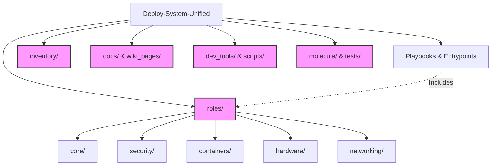

# Deploy-System-Unified

[](https://github.com/allaunthefox/deploy-system-unified/actions/workflows/style-enforcement.yml)
[](https://github.com/allaunthefox/deploy-system-unified/actions/workflows/forensic-naming-enforcer.yml)
[](https://github.com/allaunthefox/deploy-system-unified/blob/main/LICENSE)
[](https://ansible.com)
[](https://python.org)
[](./docs/compliance/CIS_MAPPING.md)
[](./docs/compliance/COMPLIANCE_REPORT.md)
[](https://github.com/allaunthefox/deploy-system-unified/commits/main)

**Modular, security-first infrastructure deployment with Ansible. CIS, NIST, ISO 27001 compliant.**

---

## 🟢 Project Status

> **Base Layer: 100% Complete (Production Ready) ✅**

The core infrastructure and security hardening layers are fully implemented, verified, and production-ready.

- **Core Roles:** 12/12 Complete (100% Idempotence)
- **Security Roles:** 18/18 Complete (5-Layer Defense)
- **Kubernetes Roles:** 4/4 Complete
- **Networking:** 7/7 Complete
- **Containers:** 13/13 Complete
- **Hardware:** 5/5 Complete
- **Virtualization:** 2/2 Complete
- **Ops:** 8/8 Complete
- **Storage:** 3/3 Complete
- **Validation:** Tested on Contabo VPS (Feb 2026)
- **Compliance:** 100/100 (ISO 27001, ISO 27040, NIST SP 800-193, CIS)

👉 **[View Detailed Implementation Status](DEPLOYMENT_STATUS)**

---

## 📋 Requirements

- **Ansible:** ≥ 2.16
- **Python:** ≥ 3.8
- **Target OS:** Ubuntu 22.04+, Debian 11+, RHEL 8+, CentOS Stream 9+
- **Architecture:** x86_64 (verified), aarch64/riscv64 (experimental)
- **Privileges:** Root/sudo access on target systems

---

## 🔧 Installation

```bash
# Clone the repository
git clone https://github.com/allaunthefox/deploy-system-unified.git
cd deploy-system-unified

# Install Python dependencies
pip install -r requirements.txt

# Install Ansible collections
ansible-galaxy install -r requirements.yml

# Verify installation
ansible --version
```

---

## 🚀 Quick Start

### Production Deployment

Use the canonical entrypoint for production deployments:

```bash
ansible-playbook PRODUCTION_DEPLOY.YML -i inventory/your_inventory.ini
```

### Architecture Support

This project is architecture-aware and supports:
- **x86_64** (Intel/AMD) - **Stable / Verified**
- **aarch64** (ARM64) - **Experimental / Unverified Hardware**
- **riscv64** (RISC-V) - **Experimental / Unverified Hardware**

Core roles and GPU drivers adapt automatically to the target architecture. Note that ARM and RISC-V support is currently in early-stage development and has not been verified on physical hardware.

### Reference Templates

Standard architecture patterns are available in `branch_templates/` for reference. Copy and customize for your deployment variant (production, development, ephemeral).

---

## 📖 Documentation

**Primary documentation hub:** [GitHub Wiki](https://github.com/allaunthefox/deploy-system-unified/wiki)

**Local documentation:** [Documentation Index](Documentation_Index)

### Key Documentation Sections

| Section | Description |
|---------|-------------|
| [Architecture](Home) | Core philosophy, virtual networking, backup strategy |
| [Development](CONTRIBUTING) | Contributing guide, style guide, tooling |
| [Deployment](EXAMPLES) | Solution stacks, vendor profiles, hardware matrix |
| [Planning]() | Roadmaps, migration plans, stability execution |

---

## 📁 Project Structure

**Audit Event Identifier:** DSU-MMD-100000  
**Mermaid Version:** 1.2  
**Renderer Support:** GitHub, GitLab, Mermaid Live  



---

## 🔧 Quick Commands

### Style Compliance Report

```bash
bash dev_tools/tools/style-guide-enforcement/enforce_style_guide.sh --report
```

### Detect Secrets Scan

```bash
pip install detect-secrets
detect-secrets scan --all-files
```

### Pre-commit Setup

See [docs/development/PRE_COMMIT.md](PRE_COMMIT) for local enforcement setup.

---

## 🤝 Contributing & Support

- **Contribution rules:** See [CONTRIBUTING.md](CONTRIBUTING)
- **Security concerns:** See [SECURITY.md](SECURITY) - we run `detect-secrets` in CI
- **Roadmap:** See [docs/planning/ROADMAP.md](ROADMAP)

## 🛡️ Compliance & Auditing

This project implements a rigorous **forensic traceability** framework linking code execution to compliance requirements.

### 🔍 Forensic Traceability

Every critical task in this repository follows a strict forensic naming convention:

`[Standard] | [Audit Event Identifier] | [Name]`

- **Standard**: The compliance control (e.g., `ISO 27001 §12.4`)
- **Audit Event Identifier**: A unique 6-digit code mapped to the **DSU Audit Event Identifier Catalog**.
- **Name**: A clear description of the task.

This ensures every action performed by Ansible leaves a high-fidelity auditable trace in our **Loki/Grafana** dashboards.

### 🏷️ Standards Coverage

> **Note:** Compliance claims are based on automated control implementation. Full certification requires organizational processes and audits. See detailed mappings in [docs/compliance]().

| Standard | Coverage | Implementation | Evidence |
|----------|----------|----------------|----------|
| **CIS Benchmark** | Level 1 & 2 (Ubuntu 22.04) | Automated via `cis_level_1` tags | [CIS Mapping](CIS_MAPPING) |
| **ISO/IEC 27001:2022** | Full Coverage | Mapped via `iso_27001` tags | [Compliance Report](COMPLIANCE_REPORT) |
| **ISO/IEC 27040:2024** | Storage Security | Automated `restore_test` enabled | [Restore Runbook](RESTORE_RUNBOOK) |
| **NIST SP 800-193** | Platform Firmware | Full compliance | [NIST Mapping](NIST_MAPPING) |
| **Autonomic Recovery**| **ISO 27040** (Storage) | Automated restore verification | [Restore Runbook](RESTORE_RUNBOOK) |
| **Forensic Intelligence**| **ISO 27001** (§12.4) | Loki-backed `Audit Event Identifier` dashboards | [Security Docs]() |

---

## 📋 Key Features

- **Security-first**: Default-deny firewall, SOPS/Age secrets, audit integrity
- **Idempotent**: All roles pass idempotence benchmarks (12/12 core roles)
- **Multi-arch**: x86_64, aarch64, riscv64 support
- **Container-native**: Podman quadlets, Caddy reverse proxy
- **Disaster recovery**: Restic/rclone backups, **ISO 27040 forensic restoration**, validated runbooks
- **CI/CD**: Style enforcement, secret scanning, wiki linting, license compliance
- **Post-Quantum Security**: Hybrid ML-KEM/Ed25519 SSH, lattice-based secret archival
- **Runtime Security**: Falco-based threat detection
- **Supply Chain**: Cosign image verification, CycloneDX SBOM generation

---

## 📦 What's Included

| Category | Roles | Status | Documentation |
|----------|-------|--------|---------------|
| **Core** | 12 | ✅ Production Ready | [docs/architecture]() |
| **Security** | 18 | ✅ Production Ready | [docs/security]() |
| **Kubernetes** | 4 | ✅ Production Ready | [docs/deployment]() |
| **Networking** | 7 | ✅ Production Ready | [docs/architecture]() |
| **Containers** | 13 | ✅ Production Ready | [docs/deployment]() |
| **Storage** | 3 | ✅ Production Ready | [docs/architecture]() |
| **Hardware** | 5 | ⚠️ **UNTESTABLE** | [docs/deployment]() |
| **Virtualization** | 2 | ✅ Production Ready | [docs/deployment]() |
| **Ops** | 8 | ✅ Production Ready | [docs/development]() |

---

## 💬 Community

- **Discussions:** [GitHub Discussions](https://github.com/allaunthefox/deploy-system-unified/discussions)
- **Issues:** [Report a bug](https://github.com/allaunthefox/deploy-system-unified/issues/new?template=bug_report.yml) | [Request a feature](https://github.com/allaunthefox/deploy-system-unified/issues/new?template=feature_request.yml)
- **Wiki:** [Documentation & Guides](https://github.com/allaunthefox/deploy-system-unified/wiki)
- **Security:** [Report a vulnerability](SECURITY)

---

## 📄 License

GPL-3.0 License - see [LICENSE](LICENSE)

See [LICENSE-COMPLIANCE.md](LICENSE-COMPLIANCE) for dependency license policy.

---

## 👥 Maintainers

- Repo owner: `@allaunthefox`
- For questions: Open an issue in the relevant category
