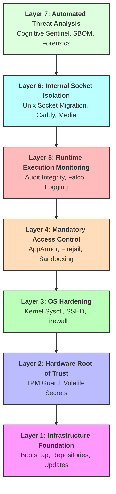

# MODULAR_LAYERS

Deploy-System-Unified utilizes a 7-layer architecture to ensure absolute isolation and "Strict Enforcement" security standards.

---

## 🏗️ Layer 1: Infrastructure Foundation
**Roles**: `core/bootstrap`, `core/repositories`, `core/updates`
- **Purpose**: Establishes identity and package provenance.
- **Enforcement**: Mandatory GPG/SHA256 verification for all sources.

## 🔒 Layer 2: Hardware Root of Trust (HRoT)
**Roles**: `core/secrets`, `security/tpm_guard`
- **Purpose**: Binds logical security to physical hardware states.
- **Enforcement**: **Volatile Secret Infrastructure** protected by a **TPM Integrity Watchdog**.

## 🛡️ Layer 3: Operating System Hardening
**Roles**: `networking/firewall`, `security/kernel`, `security/hardening`, `security/sshd`
- **Purpose**: Attack surface reduction and kernel self-protection.
- **Enforcement**: **Verified Configuration** for sysctl and protocol blacklisting.

## 🧪 Layer 4: Mandatory Access Control (MAC)
**Roles**: `security/mac_apparmor`, `security/firejail`, `security/sandboxing`
- **Purpose**: Process containment and lateral movement prevention.
- **Enforcement**: Strict enforcement of **AppArmor/SELinux** for all containerized workloads.

## 👁️ Layer 5: Runtime Execution Monitoring
**Roles**: `core/logging`, `security/audit_integrity`, `security/falco`
- **Purpose**: Real-time behavioral tracing and log immutability.
- **Enforcement**: **eBPF-based Policy Enforcement** for unauthorized syscalls.

## 👻 Layer 6: Internal Socket Isolation
**Roles**: `containers/runtime`, `containers/caddy`, `containers/media`
- **Purpose**: Zero-Trust network exposure via IPC.
- **Enforcement**: **Unix Socket Migration** for internal service communication.

## 🧠 Layer 7: Automated Threat Analysis & Provenance
**Roles**: `security/cognitive_sentinel`, `ops/forensics`, `security/sbom`
- **Purpose**: AI-driven log auditing and signed deployment metadata.
- **Enforcement**: **Local LLM Anomaly Detection** and signed **Deployment Provenance**.

---

## 💡 Architectural Principle: The Validated Chain

Each layer depends on the integrity of the layer below it. If any verification task in Layer 1-4 fails, the deployment **immediately terminates** before Layer 5-7 (the application workloads) are initialized. This ensures no system enters a production state without full security certification.

