# MODULAR_LAYERS

**Audit Event Identifier:** DSU-MMD-190001  
**Mermaid Version:** 1.2  
**Renderer Support:** GitHub, GitLab, Mermaid Live  
**Last Updated:** 2026-02-28  
**Standard:** ISO 27001 §8.20 (Network Security)  

Deploy-System-Unified utilizes a 5-layer security architecture to ensure absolute isolation and "Strict Enforcement" security standards.

```mermaid
graph TB
    subgraph "Layer 1: Pod Security"
        L1["🔒 Container Isolation<br/>Security Contexts<br/>Capabilities Drop<br/>Read-Only Root FS"]
    end

    subgraph "Layer 2: RBAC"
        L2["👤 Identity & Access<br/>ServiceAccounts<br/>Role Bindings<br/>Least Privilege"]
    end

    subgraph "Layer 3: Network Security"
        L3["🛡️ Network Isolation<br/>Network Policies<br/>TLS Encryption<br/>Ingress Control"]
    end

    subgraph "Layer 4: Secrets Management"
        L4["🔐 Secrets Protection<br/>SOPS Encryption<br/>TPM Guard<br/>Runtime Secrets"]
    end

    subgraph "Layer 5: Monitoring & Audit"
        L5["👁️ Forensic Traceability<br/>Audit Event Identifiers<br/>Prometheus/Grafana<br/>Loki Logging"]
    end

    L1 --> L2
    L2 --> L3
    L3 --> L4
    L4 --> L5

    style L1 fill:#e3f2fd,stroke:#1565c0,stroke-width:2px
    style L2 fill:#e8f5e9,stroke:#2e7d32,stroke-width:2px
    style L3 fill:#fff3e0,stroke:#ef6c00,stroke-width:2px
    style L4 fill:#f3e5f5,stroke:#7b1fa2,stroke-width:2px
    style L5 fill:#ffebee,stroke:#c62828,stroke-width:2px
```

---

## 🏗️ Layer 1: Pod Security
**Roles**: `containers/runtime`, `containers/quadlets`, `containers/config`
- **Purpose**: Container isolation through Kubernetes security contexts
- **Enforcement**: `runAsNonRoot: true`, `capabilities.drop: ALL`, `readOnlyRootFilesystem: true`
- **Audit Code**: `70xxxx` series

## 🔐 Layer 2: RBAC (Role-Based Access Control)
**Roles**: `core/identity`, `kubernetes/rbac`
- **Purpose**: Least-privilege access control for all workloads
- **Enforcement**: Per-stack ServiceAccounts with minimal Role bindings
- **Audit Code**: `30xxxx` series

## 🛡️ Layer 3: Network Security
**Roles**: `networking/firewall`, `containers/caddy`, `kubernetes/network`
- **Purpose**: Traffic isolation and encryption
- **Enforcement**: NetworkPolicies, TLS termination, ingress class control
- **Audit Code**: `54xxxx` series

## 🔒 Layer 4: Secrets Management
**Roles**: `core/secrets`, `security/tpm_guard`
- **Purpose**: Encrypted secrets at rest and in transit
- **Enforcement**: SOPS/Age encryption, TPM-backed key protection
- **Audit Code**: `45xxxx` series

## 👁️ Layer 5: Monitoring & Audit
**Roles**: `core/logging`, `security/audit_integrity`, `containers/monitoring`
- **Purpose**: Forensic traceability and real-time alerting
- **Enforcement**: Audit Event Identifiers mapped to ISO 27001, Loki aggregation
- **Audit Code**: `84xxxx` series

---

## 💡 Architectural Principle: The Validated Chain

Each layer depends on the integrity of the layer below it. If any verification task in Layers 1-4 fails, the deployment **immediately terminates** before Layer 5 (the monitoring workloads) are initialized. This ensures no system enters a production state without full security certification.

---

## 🔗 Related Documentation

- [Security Architecture Overview](../docs/deployment/mermaid/07_security_architecture.md) - Detailed security diagram
- [Security Layers](../docs/architecture/SECURITY_LAYERS.md) - Alternative visualization
- [Forensic Flow](../docs/architecture/FORENSIC_FLOW.md) - Audit event flow to Loki

---

*Standard: ISO 27001 §8.20 (Network Security)*
*Last Updated: 2026-02-28*