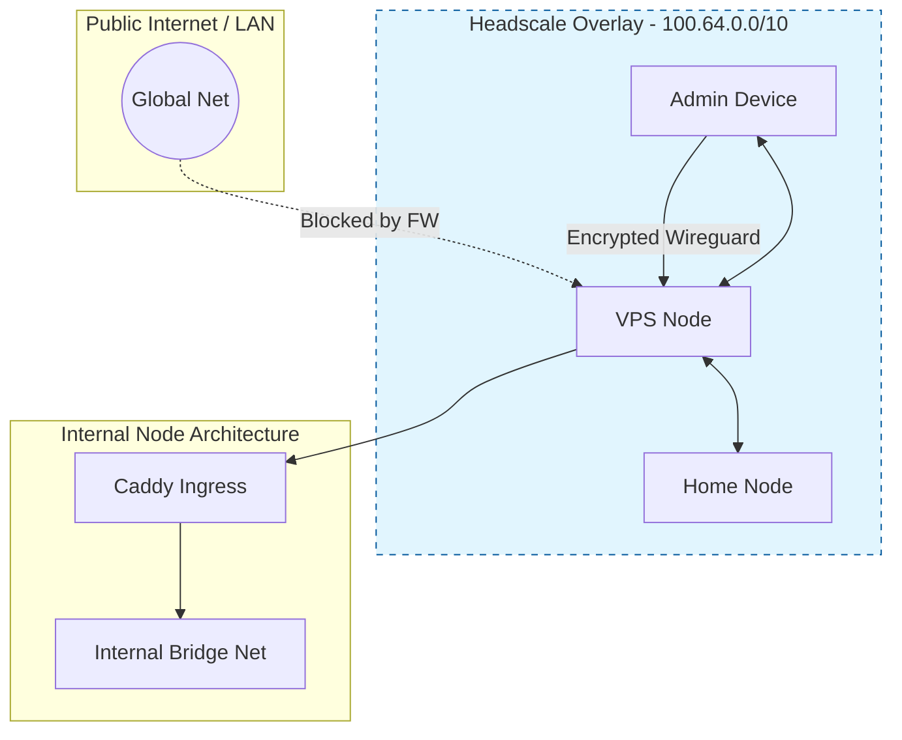

# Zero Trust Networking Strategy (Headscale/Tailscale)

**Audit Event Identifier:** DSU-MMD-180009  
**Document Type:** Architectural Strategy  
**Last Updated:** 2026-03-01  
**Status:** ✅ Mapped

This document defines the strategic mapping for Zero Trust Overlay Networks (Headscale/Tailscale) within the **Deploy-System-Unified** ecosystem. It provides guidance on when to enable the overlay based on environmental risk and deployment posture.

---

## 🗺️ Deployment Scenario Mapping

| Environment | Recommendation | Rationale | Security Posture |
| :--- | :--- | :--- | :--- |
| **Public VPS / Cloud** | 🟢 **Mandatory** | Nodes are exposed to public IPs. The overlay allows closing Port 22 (SSH) and Port 443 (Caddy) to everyone except the Tailnet. | **Maximum Hardening** |
| **Multi-Site (Hybrid)** | 🟢 **Recommended** | Securely links a home lab to a cloud node without complex Site-to-Site VPNs or port forwarding. | **Secure Interconnect** |
| **Remote Admin Only** | 🟡 **Optional** | Useful if you need to manage a local server from outside your LAN without exposing it via a traditional VPN. | **Access Convenience** |
| **Local LAN Only** | 🔴 **Not Recommended** | Adds unnecessary overhead and a potential outbound reach-back point to a coordination server. | **Attack Surface Min** |
| **Ephemeral Node** | ❌ **Disabled** | Violates the "clean room" principle. Tailscale state persists via machine keys which contradicts ephemeral logic. | **Minimal Footprint** |

---

## 🏗️ Architectural Integration

The following diagram shows how the Headscale Overlay (100.x.x.x) sits *behind* the physical network but *above* the container bridge networks.

---

## 🛡️ Enforcement Logic

When the `security/headscale` role is enabled, the following enforcement actions are taken:

1.  **Firewall Lock**: The host firewall (UFW/NFTables) is configured to drop all traffic on Port 22 (SSH) from the physical interface, allowing it ONLY from the `tailscale0` interface.
2.  **DNS Isolation**: The node can be configured to use Tailscale MagicDNS, allowing internal services to be reached via `service.tailnet-name.ts.net`.
3.  **Identity-Based ACLs**: Headscale ACLs are used to ensure that only authenticated devices with the `tag:admin` can reach the management ports of the nodes.

---

## 🔗 References
*   [NETWORK_TOPOLOGY.md](NETWORK_TOPOLOGY) - Base data flow.
*   [Q3_2026_EXECUTION_PLAN.md](Q3_2026_EXECUTION_PLAN) - Implementation timeline.
*   [STIG V-222620](https://www.stigviewer.com/stig/network_device_overarching/2021-06-16/finding/V-222620) - Network Boundary Protection alignment.
